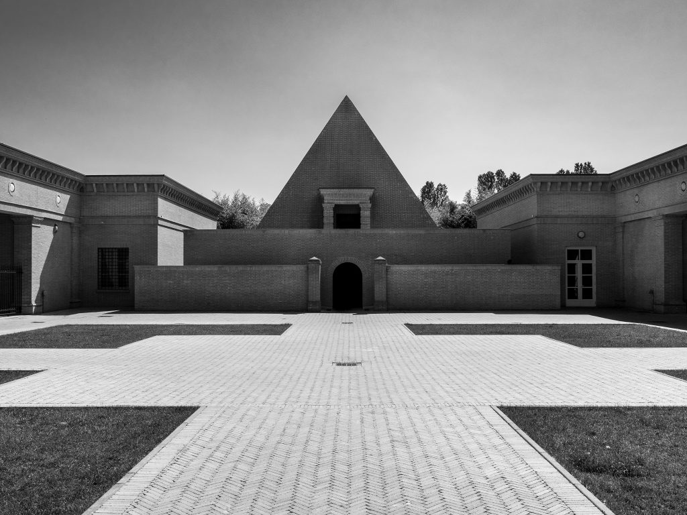
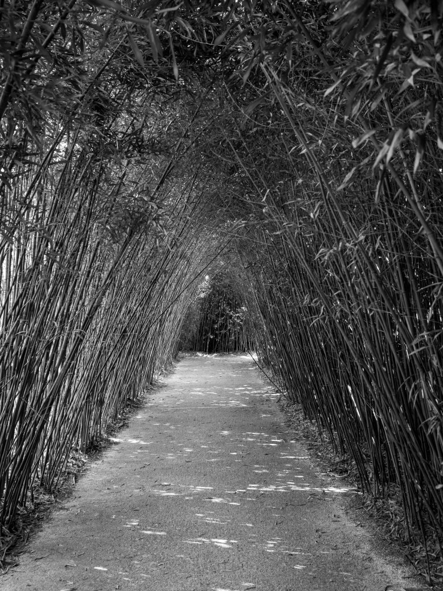
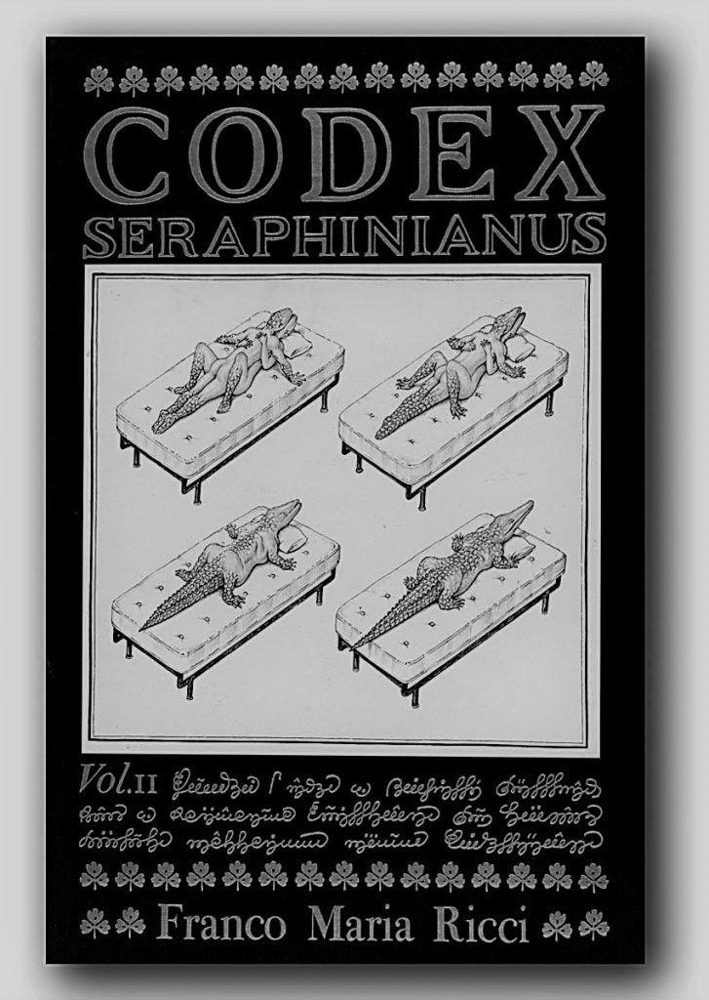
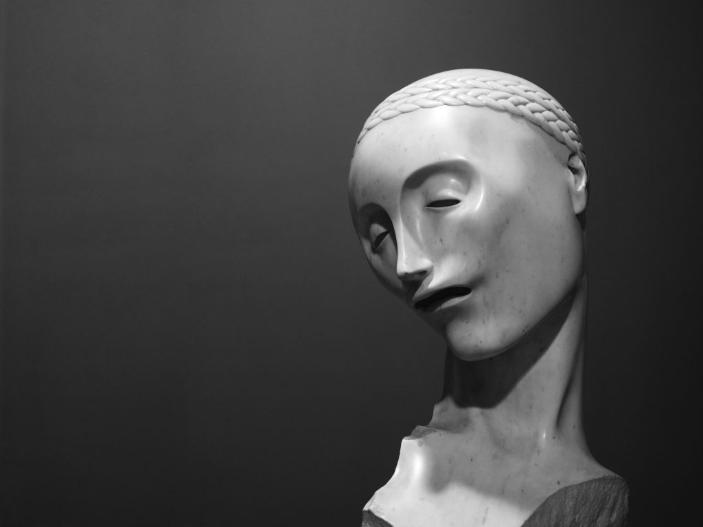
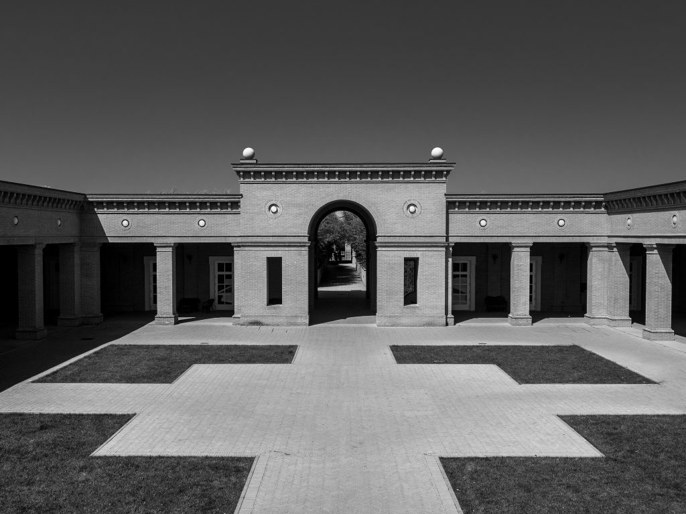

Del [Labirinto della Masone](http://www.labirintodifrancomariaricci.it) ricorderò certamente i quaranta minuti passati a camminare più o meno casualmente tra le sue 200.000 piante di bambù. D'altro canto, è il labirinto più grande del mondo e non può che esercitare fascino su di noi che, da ragazzini, siamo partiti dalle vicende di Minosse e del Minotauro per approdare alla Biblioteca di Babele di Borges, passando per i labirinti raccontati da Stephen King e da Umberto Eco.

Ricorderò però soprattutto la figura di [Franco Maria Ricci](http://www.francomariaricci.com) perché, diciamocelo, se decidi di costruire un labirinto devi essere o un matto da legare o un fottuto genio. Inutile dirlo, Ricci rientra in questa seconda categoria.

Dopo la laurea in geologia, lavora in Turchia per la Gulf Oil, che lascia nel 1963 per tornare a Parma, la città natale, e dedicarsi alle sue passioni, l'arte e la letteratura. Apre dunque uno studio di graphic design, progettando loghi e immagini per le principali aziende italiane: dai biglietti Alitalia alle copertine Bompiani, dal marchio Scic a quello Smeg.

")

Dalla grafica all'editoria, il passo è breve e l'anello di congiunzione è proprio la decisione di ristampare il [Manuale Tipografico](https://it.wikipedia.org/wiki/Giambattista_Bodoni#Il_Manuale_tipografico) di Giambattista Bodoni, pietra miliare della tipografia.

")

Si legge sul [sito ufficiale](http://www.francomariaricci.com/it/editore/editore/#section2):

> Sulle sue tracce, Ricci debuttò nell'editoria quasi per gioco, montando “una piccola officina tipografica per produrre un facsimile del Manuale”.  
> L’inatteso successo che accolse i novecento esemplari di quella ristampa confidenziale avrebbe deciso il futuro dell’impresa.  
> Il gusto per la bellezza del corpo della scrittura, per le proporzioni e l’armonia dell’impaginazione e per tutto quanto fa la “veste” di un oggetto di lettura – in breve, tutto ciò che forma la predilezione per la bibliofilia del giovane Ricci – sono all'origine delle sue collane. I segni dell’uomo, Morgana, Quadreria, Luxe, calme et volupté, Curiosa, La Biblioteca di Babele (curata da Borges stesso - NdA), Iconographia, La biblioteca blu, Guide impossibili, Italia/Antichi Stati, Grand Tour… Etichette in francese, in inglese, in latino e in italiano, sotto le quali si allineano volumi e formati di natura diversa, che accolgono tanto il saggio quanto la narrativa.
> 
> Franco Maria Ricci / editore

All'interno dell'area museale del labirinto, questa collezione di volumi è liberamente consultabile e, per i _bilbionerd_ come il sottoscritto, si tratta di un'esperienza imperdibile.

Ho poi scoperto con grande sorpresa che Franco Maria Ricci è stato il primo editore del Codex Seraphinianus: per chi non lo conoscesse, si tratta di un tomo scritto e illustrato da Luigi Serafini, una sorta di enciclopedia di un mondo fantastico, scritto in una lingua inventata e senza significato, in un alfabeto indecifrabile, diventata oggetto di culto in tutto il mondo. [Questo articolo](https://www.ilpost.it/2016/06/16/codex-seraphinianus/) de il Post ne racconta la curiosa storia.

Al lavoro di designer ed editore, Ricci accosta infine la passione per l'arte, arrivando a collezionare più di quattrocentocinquanta opere e dando forma ad una raccolta unica ed eccentrica, in parte anch'essa visitabile: incontri fortuiti e colpi di fulmine hanno allineato uno accanto all'altro busti marmorei barocchi e neoclassici, _gisants_ rinascimentali e bronzi wildtiani, danzatrici crisoelefantine e allegorie manieriste, ritratti di dame della Parma borbonica e di gentiluomini del Lombardo-Veneto.

Non ho certo la pretesa di aver riassunto, in queste poche righe, tutta la ricchezza e la complessità di un personaggio unico come Franco Maria Ricci. Vi invito quindi a proseguire il viaggio sul [sito](http://www.arte.rai.it/articoli/franco-maria-ricci/2693/default.aspx) di Rai Storia e, soprattutto, a prendervi una mezza giornata per andare a Fontanellato e perdervi, tanto nel labirinto quanto nella bellezza delle opere che vi troverete di fronte.

