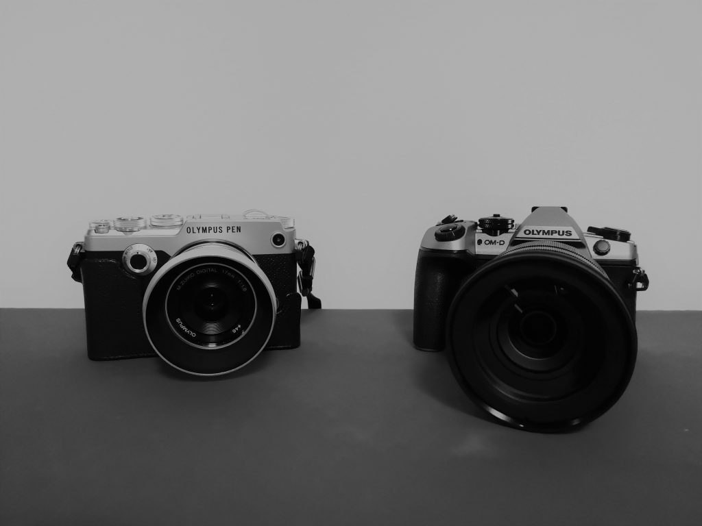
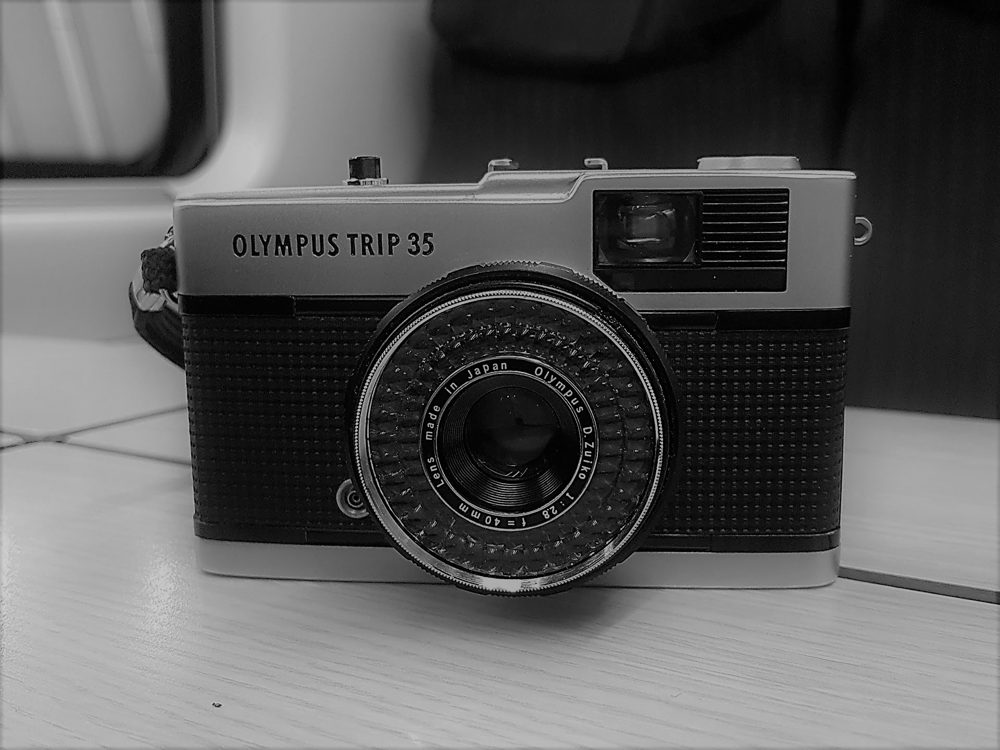

Sono pigro e amo viaggiare leggero. Per questo motivo, mi affido alla mia Pen F, a cui affianco una serie di ottiche fisse: il 9 mm f2.8, il 12 mm f2, il 17 mm e il 45 mm, entrambi f1.8.

Qualche anno fa mi sono deciso ad affiancare alla Pen anche una OMD Em1-mk2 con uno strepitoso 12-100 f4 PRO. Una combo da viaggio davvero straordinaria.

Nel mio zaino, trovano posto anche una batteria di scorta, qualche scheda SD, un treppiede Sirui in carbonio e due filtri Nisi: un polazrizzatore e un ND1000.

Quando proprio voglio esagerare, esco con una bellissima Olympus Trip 35 caricata con un rullino di Kodal Tri X 400.

Ah, e comunque è [tutta colpa](../parole/e-tutta-colpa-tua/) di mio papà.