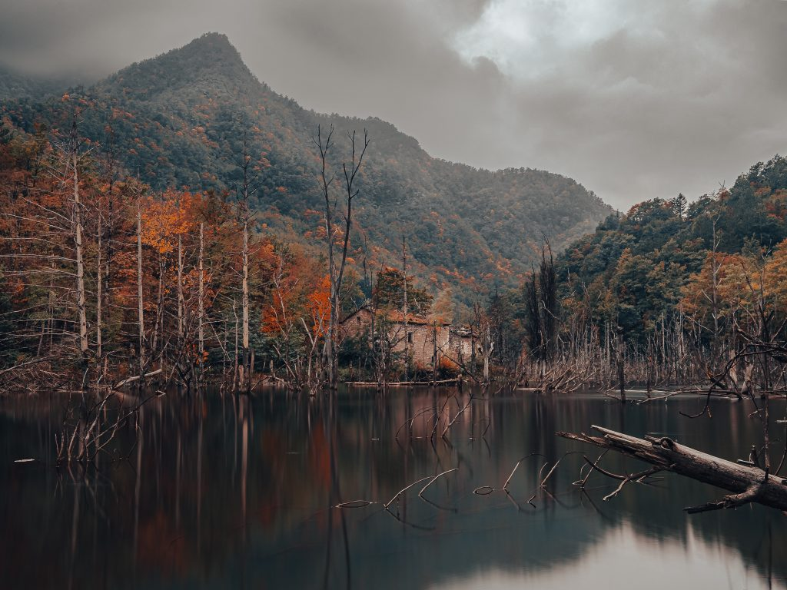

Alle porte delle Foreste Casentinesi, il [lago di Poggio Baldi](https://goo.gl/maps/Ryh6sc5LszDaycDE9) a Corniolo sprigiona tutto il suo fascino durante le uggiose giornate di Autunno. Nato a causa di una frana che nel 2010 ha sbarrato il corso del fiume Bidente, invadendo un bosco di Douglasie. I tronchi bianchi che emergono dalle acque del lago contrastano con i toni accesi delle foglie prossime alla caduta.

