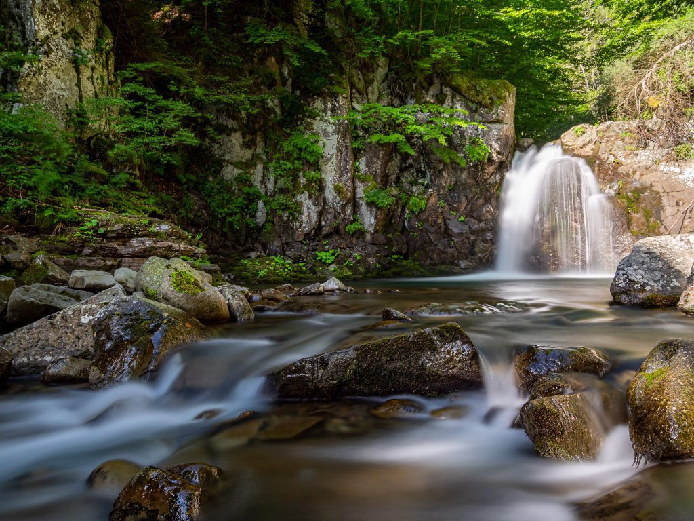

Il grande ritorno del [Circolo Fotografico La Tagliatella](https://www.instagram.com/euge70/), alle prese con l'anello delle cascate di Sant’Anna Pelago. Sveglia alle 5:45, 10,5 km tra boschi e cascate, conclusione tra tagliatelle al cinghiale e formaggio fritto nello speck.

Coefficiente Poli-Mondini (numero di calorie per scatto) nella media.

