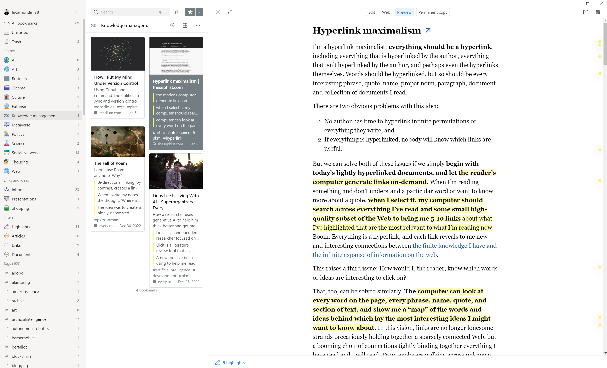
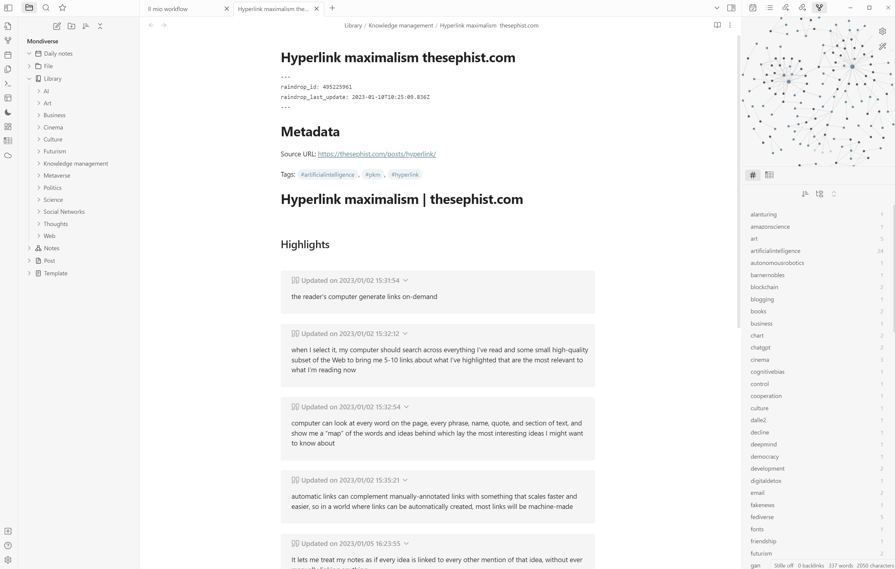
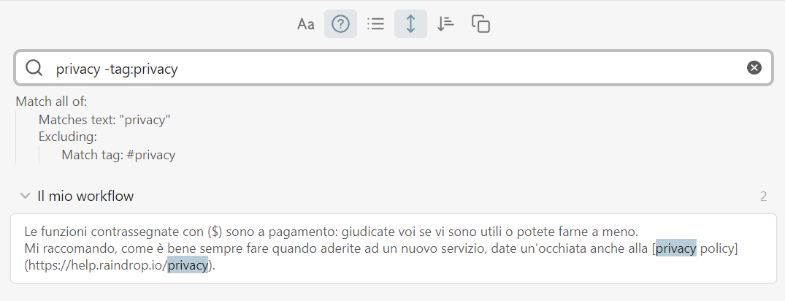
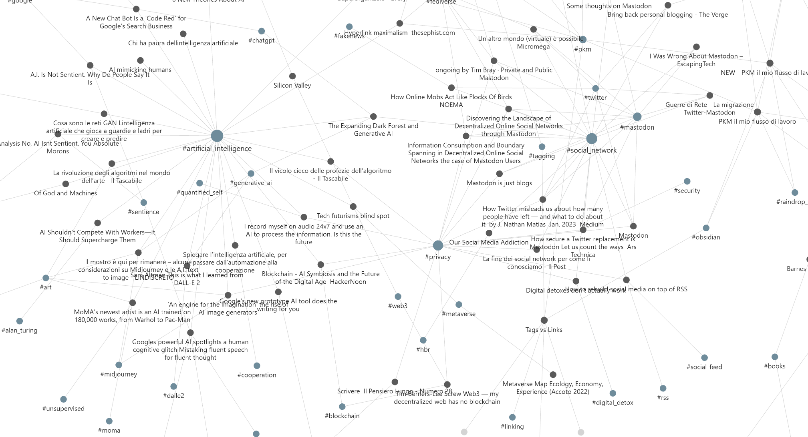
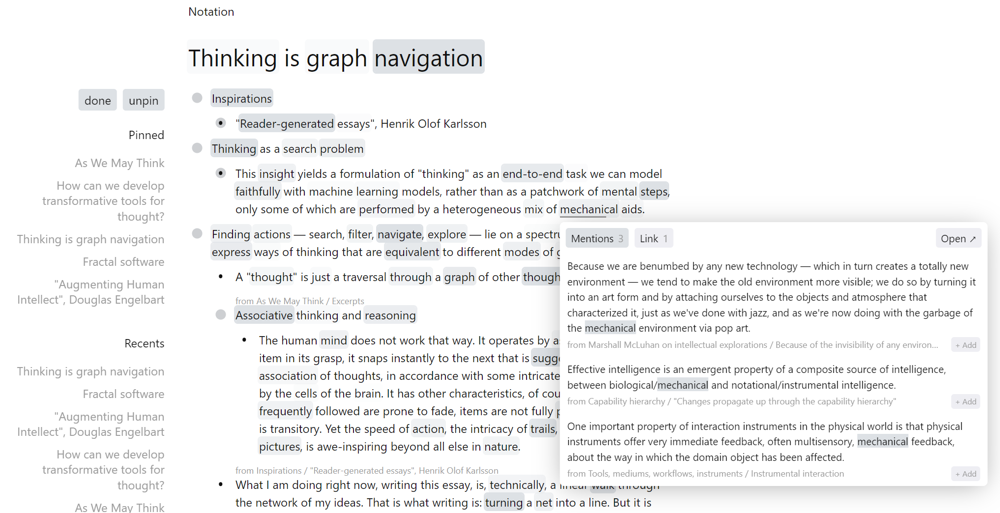


Stato: 🗒️ [in corso](../../etc/#Stato-dei-post "In corso è lo stato di una idea ben sviluppata che comincia ad avere una propria dignità")  
Prima versione: 3 gennaio 2023  
Ultimo aggiornamento: 15 gennaio 2023


## Introduzione

Negli ultimi anni l'interesse verso il Personal Knowledge Management (PKM) si è molto diffuso, anche grazie allo sviluppo di software a supporto come [Roam Research](https://roamresearch.com/), [Notion](https://www.notion.so/) o [Obsidian](https://obsidian.md/).

Se non sapete minimamente di cosa sto parlando, vi consiglio [un](https://www.youtube.com/watch?v=Q2WBHyqRsxA) [paio](https://www.youtube.com/watch?v=Qb2L77e8izU) di video che offrono una valida introduzione. In estrema sintesi, sappiate che il PKM è un insieme di pratiche, strumenti e tecniche che le persone utilizzano per raccogliere, organizzare, conservare e condividere le informazioni e la conoscenza in modo efficace.

Il mese scorso ho iniziato a riflettere sul mio flusso di lavoro e a cercare di strutturarlo e razionalizzarlo meglio. Per prima cosa, ho elencato i principi intorno ai quali definirlo:

- Semplicità: tutto deve essere il più leggero e semplice possibile. Per noi nerd è estremamente semplice innamorarci di una metodologia o, peggio, di uno strumento con il rischio di spendere più tempo nello studio teorico e nella configurazione che nell'utilizzo vero e proprio.
- Flessibilità: il workflow deve adattarsi a me e non viceversa e deve, soprattutto, continuare a farlo nel tempo. Adottare una metodologia a scatola chiusa non è mai cosa buona e giusta perché introduce, il più delle volte, rigidità e vincoli non necessari.
- Portabilità: i contenuti devono essere in formato [Markdown](https://www.markdownguide.org/) per favorire leggibilità, interoperabilità e indipendenza dagli strumenti.
- Costo: gli strumenti usati devono avere un costo ragionevole o, meglio ancora, esserne privi.

Ad essi, ho quindi affiancato una lista di funzionalità per me fondamentali:

- Highlighting: deve essere possibile, in prima battuta, sottolineare e archiviare i testi che leggo online. La gestione di altri tipi di contenuti come libri, podcast e video non sono centrali in questa prima fase.
- Organizzazione: i contenuti devono essere organizzabili in tutte le principali modalità, come cartelle, tag o link / backlink.
- Sincronizzazione: la sincronizzazione dei contenuti tra più device (Android, Windows, Linux) deve essere supportata.
- Esportazione: deve essere relativamente semplice pubblicare le mie note sul [sito](https://www.lucamondini.it) e, possibilmente, anche sui social network.

## Workflow

Definiti principi e requisiti, ho individuato le tre fasi principali del mio flusso di lavoro:

1. Collecting: la fase iniziale dove tutti i contenuti entrano nel sistema.
2. Processing and storing: la fase di elaborazione e archiviazione delle note prodotte.
3. Sharing: la fase finale di eventuale condivisione online dei contenuti.

Ho cercato quindi uno o più strumenti che rispondessero alle mie esigenze in ognuna di queste tre fasi. Obsidian è risultato essere il fulcro di tutto il sistema, in corrispondenza con i principi emersi e supportando ben oltre le funzionalità richieste. Non mi dilungo nella descrizione delle sue infinite funzionalità: in rete trovate fantastiliardi di contenuti, oltre ad un [forum](https://forum.obsidian.md/), una [community Discord](https://discord.gg/obsidianmd) e un [subreddit](https://www.reddit.com/r/ObsidianMD/),  tutti molto vivaci.
Ad esso ho affiancato [Raindrop.io](https://raindrop.io/) per la gestione degli articoli su web e della relativa sottolineatura e [Hugo](https://gohugo.io/) come framework per la generazione del mio sito web.

Entriamo nel dettaglio.

Obsidian è uno strumento molto potente e altrettanto flessibile: allo stato attuale, esistono 25 core plugin e oltre 800 plugin sviluppati dalla community per estenderne le funzionalità, oltre a temi e custom CSS utili a modificarne l'aspetto.
In virtù del principio di semplicità, sto cercando di mantenere il software il pulito possibile, installando solo ciò che mi serve realmente. Al momento utilizzo i seguenti community plugin:

- [Advanced Tables](https://github.com/tgrosinger/advanced-tables-obsidian): consente di gestire un po' più agilmente le tabelle.
- [Calendar](https://github.com/liamcain/obsidian-calendar-plugin): visualizza le note del giorno in un calendario mensile.
- [Hider](https://github.com/kepano/obsidian-hider): permette di nascondere vari elementi della UI come la barra di stato o quella del titolo. Per ora lo sto utilizzando quando voglio un ambiente di scrittura il più possibile privo di distrazioni (modalità concentrazione o focus mode). Non so onestamente se lo manterrò.
- [Icon Folder](https://github.com/FlorianWoelki/obsidian-icon-folder): questo plugin consente di aggiungere un emoji o una icona a un file o una cartella. Lo utilizzo per avere un'icona delle cartelle principali che costituiscono il mio archivio.
- [Paste URL into selection](https://github.com/denolehov/obsidian-url-into-selection): aggiunge il link copiato al testo selezionato.
- [Raindrop Highlights](https://github.com/kaiiiz/obsidian-raindrop-highlights-plugin): trasferisce in archivio link e sottolineature degli articoli letti online. Lo vediamo tra poco.
- [Stille](https://github.com/michaellee/stille): all'interno di una nota, evidenzia la porzione di testo che stai scrivendo, sfumando le altre. Utile anch'esso in modalità concentrazione.

Anche per quanto riguarda l'aspetto, tutto è piuttosto minimale: tema di default e breve CSS custom per modificare i colori di alcuni elementi, uniformandoli a quelli del sistema operativo in uso.

Veniamo ora al mio *vault*, ovvero l'archivio, suddiviso in sei cartelle, che sottende al mio flusso di lavoro:

- **Daily notes**: le note giornaliere. Di fatto, insieme alla cartella Library, è uno dei due punti di ingresso del sistema. Le daily notes hanno come titolo la data di creazione e le uso per raccogliere appunti veloci, brevi annotazioni o idee che dovranno poi essere riprocessati.
- **Library**: è l'archivio delle mie sottolineature agli articoli che leggo sul web, il secondo punto di ingresso del mio flusso.
- **Notes**: l'insieme delle note "finali" o "permanenti", ovvero quelle già processate. Tipicamente, sono note piuttosto brevi, aventi un perimetro ben delineato e, possibilmente, linkate tra loro.
- **Files**: tutto ciò che non è una nota testuale, come immagini o documenti PDF. Insomma: la cartella degli allegati che vengono richiamati dalle note.
- **Post**: sono note che combinano e condensano quanto presente nelle altre cartelle in articoli da condividere altrove (tipicamente sul sito o sui social). È il punto di uscita da Obsidian.
- **Template**: è una cartella di servizio. Obsidian consente di creare template da applicare alle singole note. Io ne uso attualmente uno solo, contenente i metadati che servono a Hugo per generare i contenuti del sito (ne parleremo a breve).

In sintesi, ecco processo e strumenti, sotto forma di semplice flowchart:


Tutto l'archivio si trova attualmente in una cartella OneDrive, così da rendere perfettamente trasparente la sincronizzazione tra il mio desktop e il mio portatile. Per quanto riguarda la sincronizzazione su mobile, al momento, non ne ho grande necessità: se sono in giro, mi accontento di appuntare qualche idea veloce su Keep.


### Collecting

Come abbiamo detto, i punti di ingresso sono due:
1. Daily notes
2. Library

Sulle prime c'è poco da aggiungere, mentre vale la pena soffermarsi sulla Library.
Fin da quando andavo a scuola, sottolineare e annotare i testi è sempre stata una pratica per me imprescindibile. Oggi, che leggo moltissimo materiale online, è rimasta la medesima esigenza. Raindrop la soddisfa abbondantemente, permettendomi di:

- Salvare gli articoli in un archivio organizzabile in collezioni, taggabile e ricercabile.
- Leggere il contenuto degli articoli in un formato semplificato e privo di pubblicità.
- Sottolineare il testo in più colori.
- Aggiungere note alle sottolineature ($).
- Avere una copia locale degli articoli nel caso, [non troppo raro](https://whyy.org/articles/if-its-online-its-not-permanent-internet-archives-can-disappear/), che un post scompaia ($).
- Avere un backup del mio archivio.

Le funzioni contrassegnate con ($) sono a pagamento: giudicate voi se vi sono utili o potete farne a meno.
Mi raccomando, come è sempre bene fare quando aderite ad un nuovo servizio, date un'occhiata anche alla [privacy policy](https://help.raindrop.io/privacy).



Uno dei vantaggi di Raindrop è che, come anticipato, si integra perfettamente con Obsidian, grazie al plugin raindrop-highlights che trasferisce cartelle, note e sottolineature nel vault (cartella Library).



Come vedete, nel passaggio, anche i tag vengono mantenuti e riconosciuti.


### Processing and storing

Bene, ho la mia libreria di link e sottolineature e le mie note giornaliere da processare. Ma cosa vuol dire processare? 
Io ho fatto mia la definizione di "Permanent notes" scritta da [Sönke Ahrens](https://www.soenkeahrens.de/en/home), autore di "How to take smart notes":

> Permanent notes, which will never be thrown away and contain the necessary information in themselves in a permanently understandable way.

Quindi, processare significa riscrivere i concetti con parole proprie in note atomiche ed autoconsistenti, affinché siano sempre comprensibili e fruibili in futuro.
Lo faccio per tutta la mia libreria? No, ci arrivo a breve.

Si apre infatti un tema che nasconde in realtà un intero universo, ovvero come organizzare e catalogare tutti questi contenuti. 
Ogni sistema di PKM ha la propria metodologia, da [Zettelkasten](https://zettelkasten.de/introduction/) (di cui parla il libro di Ahrens) a [Second Brain](https://www.buildingasecondbrain.com/), tanto per citarne un paio tra le più famose. Dal canto mio, come scrivevo nell'introduzione, ho imparato ad adattare le metodologie che imparo al mio modo di pensare e di lavorare.
Attualmente (in futuro chissà!) mi affido principalmente ai tag. Sono consapevole che si tratti di un sistema imperfetto e [questo thread](https://www.reddit.com/r/ObsidianMD/comments/n7m5gx/comment/gxdlxb5/) su r/ObsdianMD ne riassume alcuni problemi:

> Extensive content-based tagging is a known anti-pattern because tags create a weak association _at best_ between notes.
> By using content-based tags you are making yourself feel that you are creating associations but you are still really shifting the burden to your future self to figure out _why_ the notes are associated.
> 
> This becomes a significant problem when you have a larger corpus and your tag ontology begins growing beyond control.
> Once you decide to tag based on subject you have to keep expanding the subjects you tag.
> Then every time you add a tag later you have to decide if you will go back and re-tag all applicable prior notes, which quickly becomes untenable.
> But if you don't do that then your tagging system becomes untrustworthy, because it is not returning all notes that it should, so you start developing workarounds to compensate for the faulty tagging system, which increases the friction of using the system.

La mia opinione è che questi rischi si possano mitigare, almeno in parte, grazie ad alcune buone pratiche nella scelta e nell'utilizzo dei tag e alla funzione di [ricerca](https://help.obsidian.md/Plugins/Search) interna di Obsidian.
I [consigli](https://www.dsebastien.net/2022-05-17-why-and-how-to-tag-notes-in-your-pkm/) di Sebastien Dubois sono un buon punto di partenza:
- Taggare le note non appena le si crea. In seguito, se necessario, si possono comunque aggiornare.
- Limitarsi a 10 tag al massimo. Un numero maggiore non porta vantaggi.
- La consistenza è fondamentale: cercare di riutilizzare sempre gli stessi tag è sempre preferibile.
- Per quanto riguarda la naming, evitare le maiuscole e utilizzare l'underscore per separare le parole.

Lo strumento di ricerca entra in gioco nella manutenzione dell'ontologia dei tag. Un esempio tra i più semplici è quello di cercare le note che contengono una parola, escludendo quelle taggate con la parola stessa:



Molto utile secondo me la possibilità di espandere il contesto dei risultati di ricerca per capire meglio dove si colloca il termine cercato.
Le possibilità sono ovviamente molto più ampie, considerando il fatto che è possibile costruire query complesse mediante operatori logici o regular expression.

I tag mi permettono dunque di raggruppare e organizzare tutti i contenuti senza affidarmi solamente ai link espliciti.




Ecco, parliamo dei link tra le note.

Obsidian, come tutti gli altri software di questo tipo, supporta [linking](https://help.obsidian.md/Plugins/Outgoing+links) e [backlinking](https://help.obsidian.md/Plugins/Backlinks) per la creazione di un grafo di conoscenza fortemente connesso, con l'obiettivo di aumentare la serendipità e diminuire il rischio di perdersi dei pezzi per strada.
Si tratta sicuramente di uno strumento molto potente e mi capita di utilizzarlo nelle note finali ma, per come lavoro io (e, [a quanto pare](https://every.to/superorganizers/the-fall-of-roam), non sono l'unico), non può essere l'unico fulcro del mio sistema.
Banalmente, non avrei il tempo di riscrivere tutte le sottolineature degli articoli letti in note finali: favorisce l'apprendimento, è vero, ma occorre essere realisti.

Recentemente mi sono invece imbattuto in [questo post](https://thesephist.com/posts/hyperlink/) di Linus Lee: per il suo personale flusso di lavoro, ha sviluppato un'applicazione per prendere appunti, chiamata [Notation](https://notation.app/). La particolarità di questo software è che aggiunge automaticamente al testo un layer, anzi una heatmap, che mostra tutti i punti in cui ogni termine è già stato menzionato, dando priorità ai riferimenti aventi contesti simili.
Notation permette in sostanza di creare il grafo della conoscenza in modo implicito e automatico.



Mi piace molto questa idea e spero che prima o poi venga sviluppato un plugin Obsidian che faccia qualcosa di simile.


### Sharing

Eccoci all'ultima fase, ovvero la condivisione online dei miei contenuti. Come dicevo, anche ciò che scrivo sul sito e, in parte, sui social sono delle note che archivio nel mio vault, all'interno della cartella Post.
Nel caso dei social, [Mastodon](https://mastodon.uno/@lucamondini) soprattutto, mi limito poi a copiare e incollare il testo della nota mentre, per quanto riguarda il sito, le cose si fanno più interessanti.

Da quando ho iniziato a scrivere sul web, a occhio e croce direi vent'anni fa (!!), mi sono sempre affidato a [Wordpress](https://wordpress.org/) ma ultimamente mi sono reso conto di quanto fosse diventato sovra-strutturato per le mie esigenze. Posto, se va bene, un paio di volte al mese e le visite sono infinitesime: tenere in piedi un web server e un database mi sembra davvero eccessivo. Per non parlare dei plugin e dei temi da aggiornare con regolarità.

Ho quindi migrato i contenuti verso un sito statico generato dal framework Hugo, il quale mi ha portato subito due vantaggi: una velocità di rendering delle pagine strepitosa e la possibilità di usare Markdown come formato per i contenuti, rendendolo quindi facilmente integrabile nel mio processo.

Tornando ad Obsidian, trovo utile sfruttare i [template](https://help.obsidian.md/Plugins/Templates) per aggiungere le intestazioni necessarie a Hugo:

```
---
title: "{{title}}"
date: {{date}}
description: ""
summary: ""
tags: ["", "", ""]
---
```

In questo modo, basta copiare il file .md del mio post insieme alle eventuali immagini nella directory Content di Hugo per poter rigenerare il sito (a dir la verità, devo anche sistemare i link alle immagini, ma sto cercando di automatizzare questo passo).
Poiché il codice è interamente ospitato su un [repository](https://github.com/lucamondini/lm.it) GitHub, una volta fatto il commit della modifica, l'ambiente FTP del mio hosting viene [automaticamente](https://github.com/marketplace/actions/ftp-deployment) aggiornato.

## Conclusione

Questi appunti sono, di fatto, il primo passo del mio percorso verso il Personal Knowledge Management: ci sono certamente cose da rivedere e anche alcuni approcci discutibili, ma ho preferito lanciarmi e sperimentare, proprio come farebbe un [giardiniere digitale](../di-idee-e-giardini-digitali/).
Sicuramente, tra le prime cose, proverò ad integrare nel flusso anche le note provenienti da libri, documenti PDF, podcast o video: esistono diversi plugin Obsidian adatti allo scopo ma non ho ancora avuto il tempo di testarli.

Un appunto finale: tutto va comunque nella direzione di tornare in possesso dei miei contenuti, dei loro formati e degli spazi che li ospitano. L'affaire Musk - Twitter degli ultimi mesi, per quanto mi riguarda, ne ha ribadito la necessità a gran voce!

Se avete commenti o suggerimenti, potete scrivermi come sempre ai contatti qui sotto.