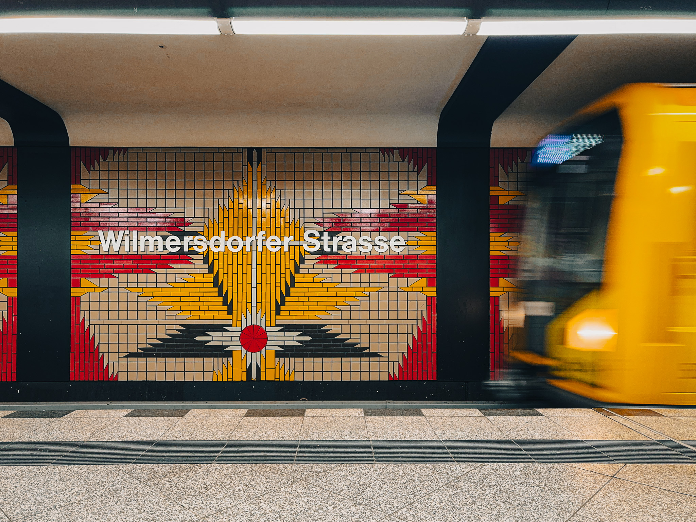

Da semplice fotografo amatoriale, penso che il telefono possa essere oggi uno strumento valido per un certo tipo di fotografia, tenendo bene a mente potenzialità e, soprattutto, limiti.

Ho bisogno di lunghe esposizioni, soggetti in movimento, fotografia notturna? Macchina fotografica. Per il resto, gli 80 Mb di file raw che sforna il mio iPhone (ma sono certo che anche i top Android facciano lo stesso) possono andare più che bene in moltissime situazioni.

Devo dire che mi sono divertito, ed è un esperimento che rifarò senz'altro. Tra l'altro, la metropolitana è davvero fotogenica: ci sono delle stazioni [molto suggestive](https://medium.com/5-a-m/berlin-bahn-33718a55dbf0).

