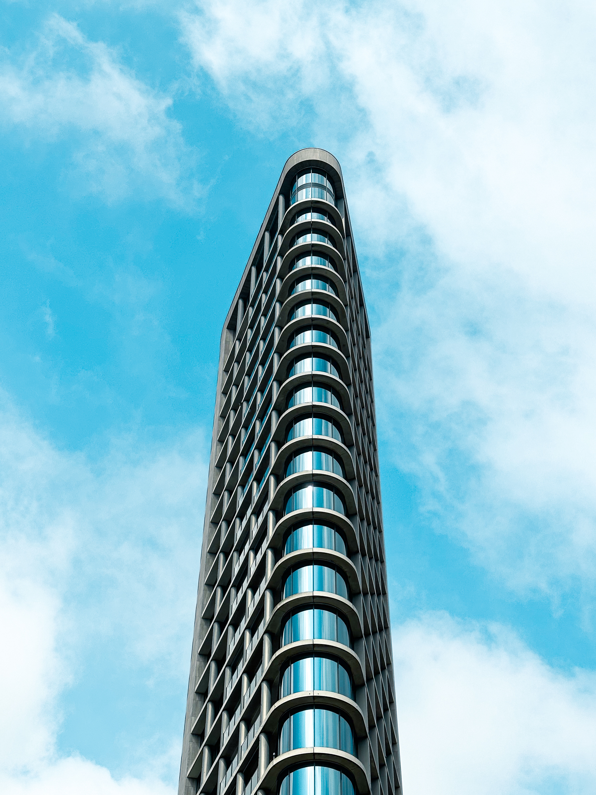
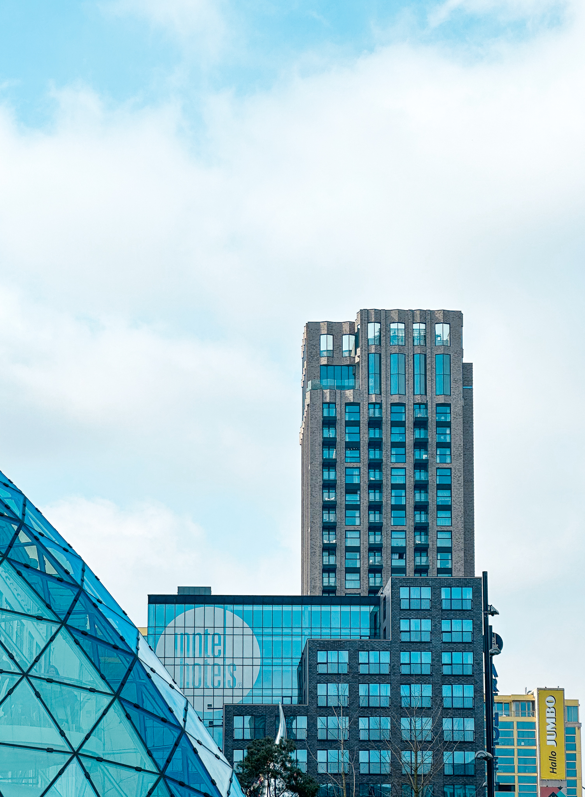
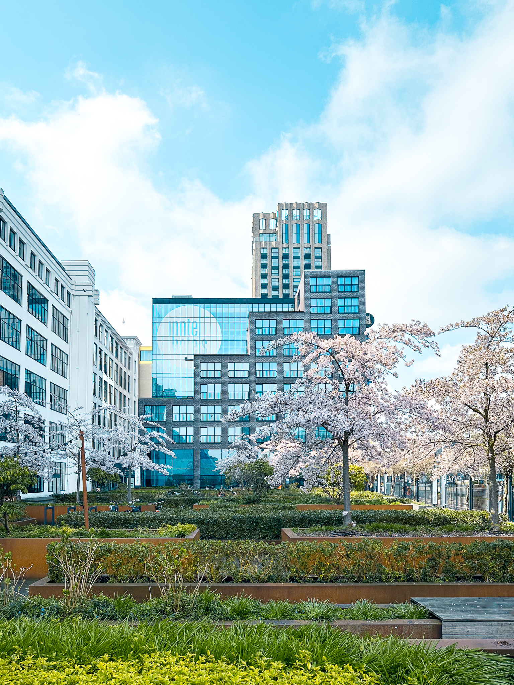
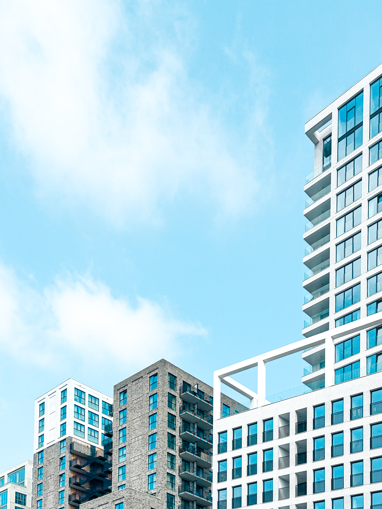
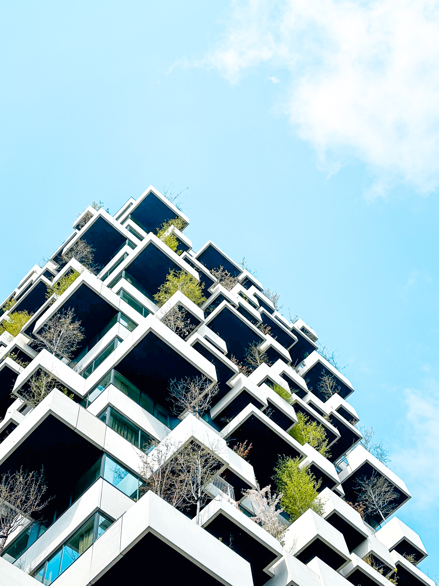
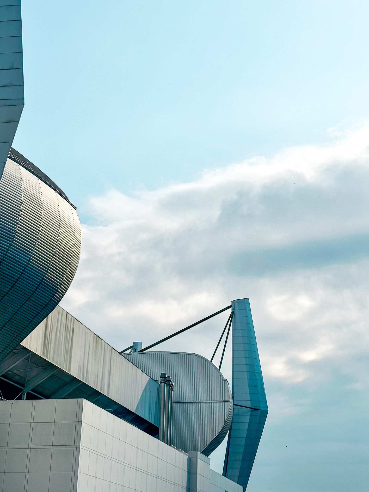

Per la prima volta, durante le vacanze pasquali, complice il cambio di lavoro di Consuelo, ci siamo mossi da casa e abbiamo trascorso qualche giorno a Eindhoven.

Una meta insolita, conosciuta ai più soltanto per la squadra di calcio e che abbiamo scoperto grazie ai [consigli](https://www.travelonart.com/arte-contemporanea/street-art-eindhoven-guida-viaggio/) di Travel on art (non le seguite? Male!).
Ci siamo trovati di fronte ad una città ricca di vita, con [musei strafighi](https://www.lucamondini.it/parole/van-abbemuseum/) e un'architettura moderna e accattivante.

Qualche scatto raccolto, conscio di aver tralasciato alcuni tra i palazzi più famosi perché sempre circondati dalla folla.

