Con straordinario ritardo, ecco qualche scatto in giro per [Fotografia Europea](https://www.fotografiaeuropea.it/), il cui tema di quest'anno era "visioni di un'identità inquieta".

Mi rendo conto che sono buttate un po' così: il prossimo anno voglio lavorarci meglio, annotando artisti e riferimenti; altrimenti, passata qualche settimana, perdo ogni contatto con ciò che ho visto.  
Per non parlare delle mostre del circuito OFF, che non ho nemmeno fotografato e di cui è più difficile trovare informazioni in rete.

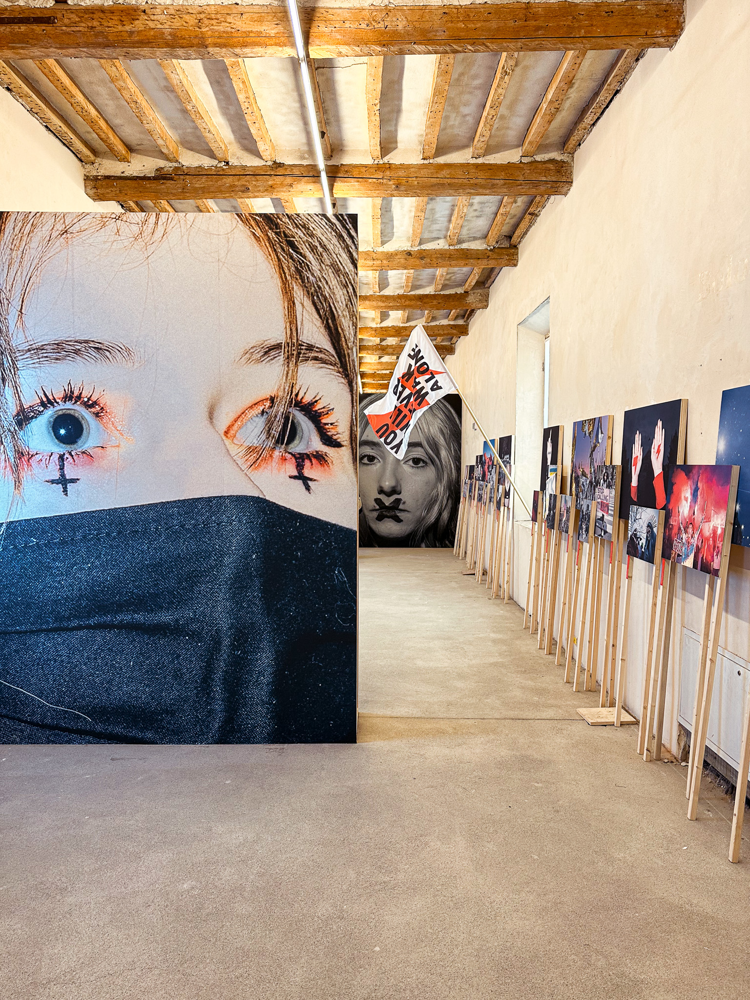
    
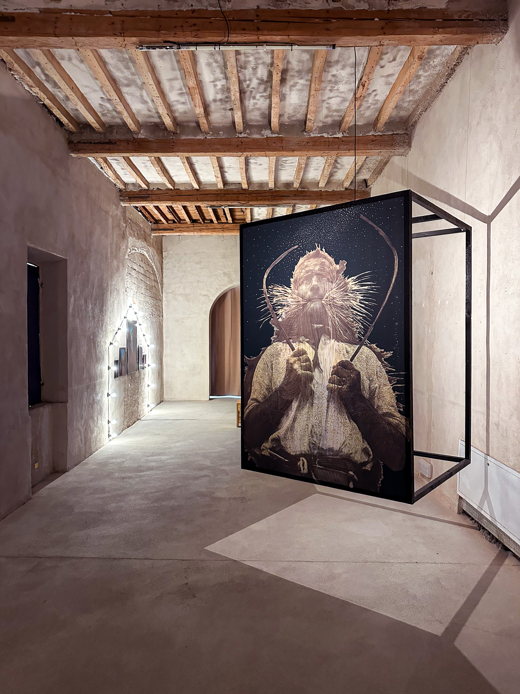
    
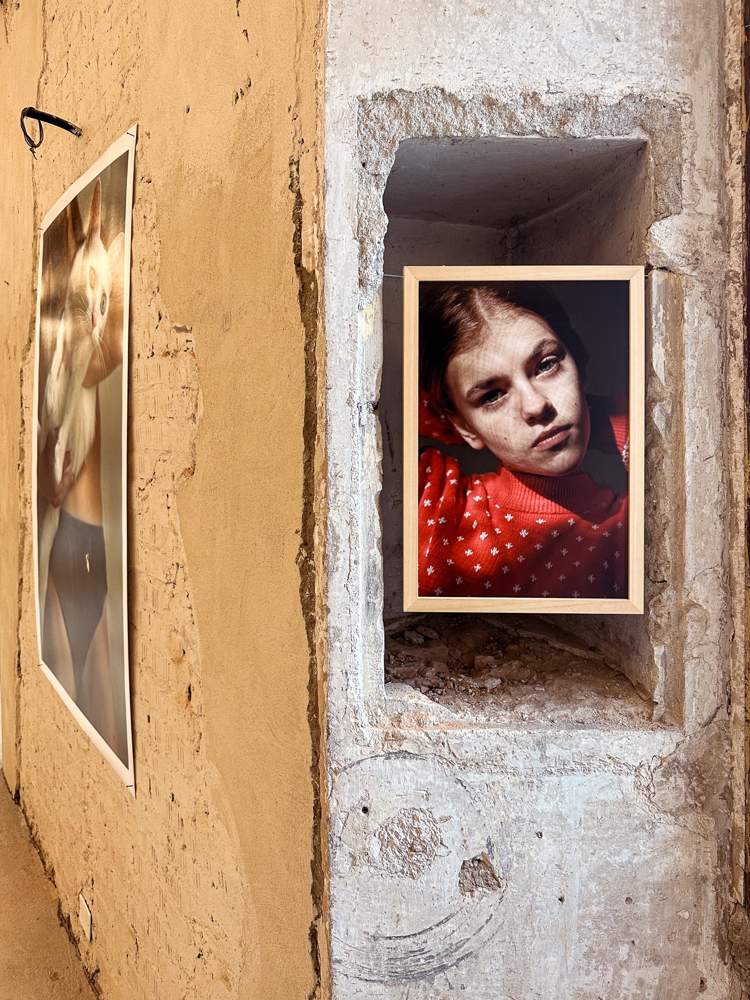
    
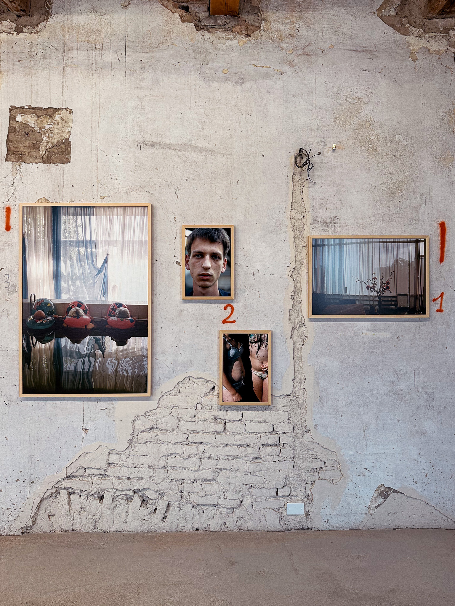
    
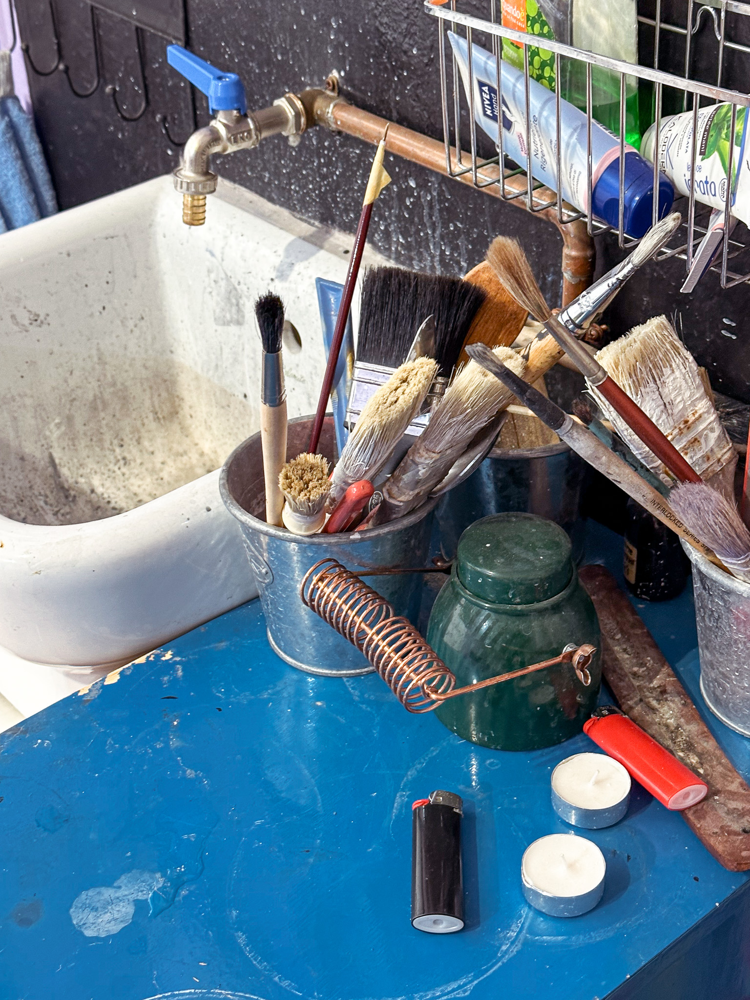
    
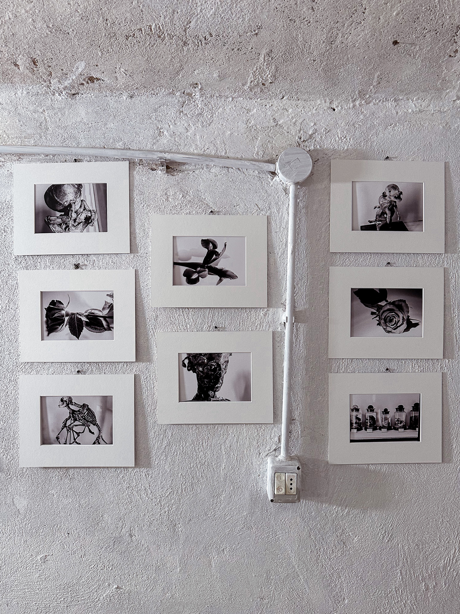
    
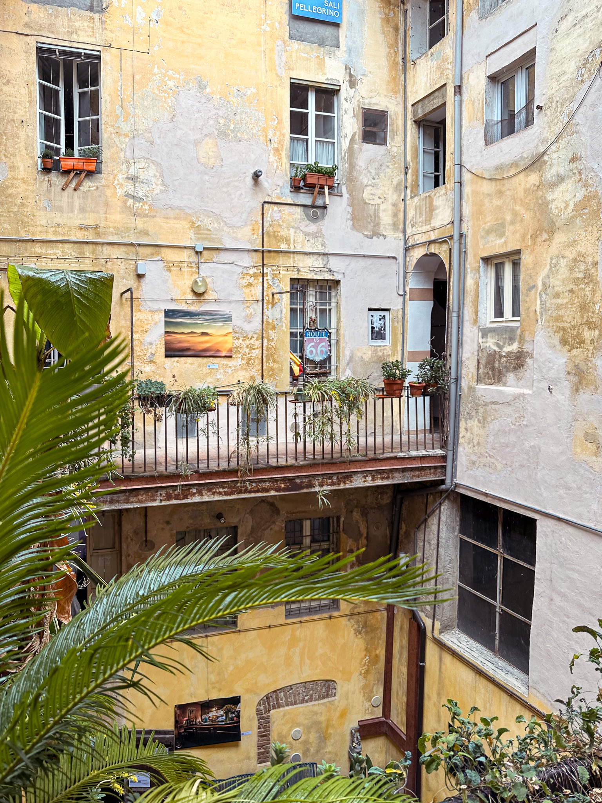
    
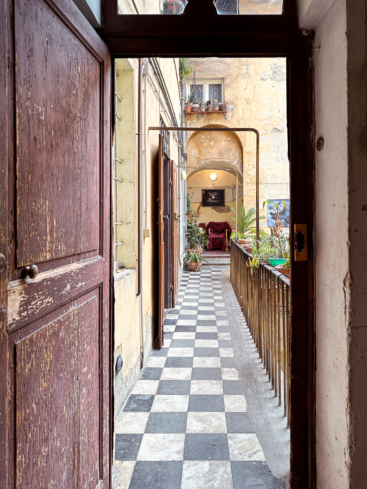
    
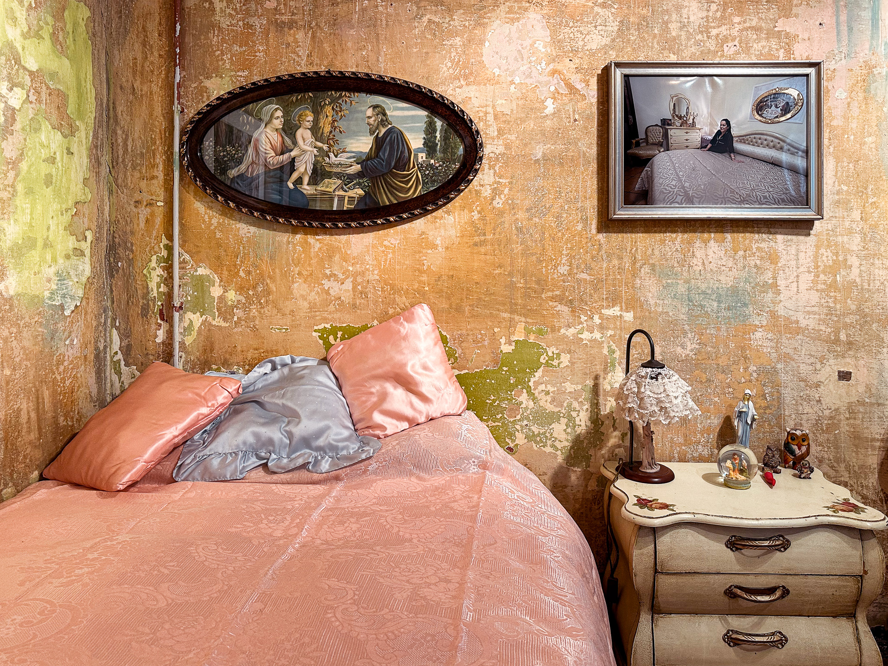

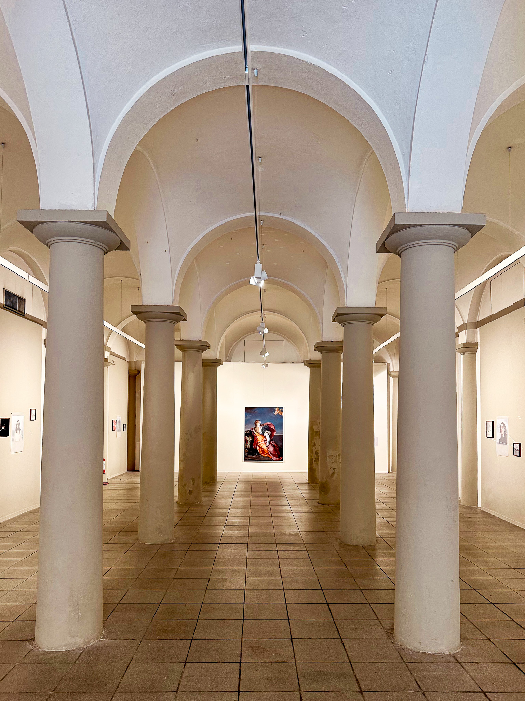

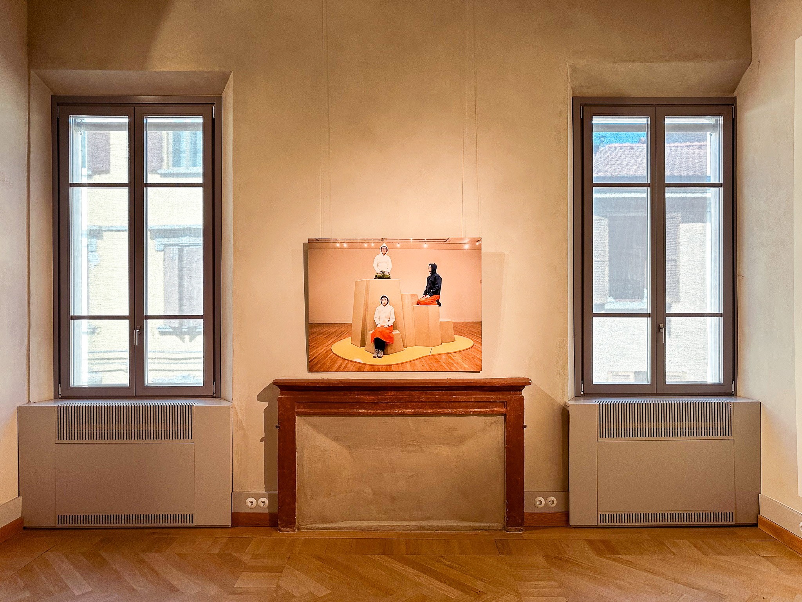

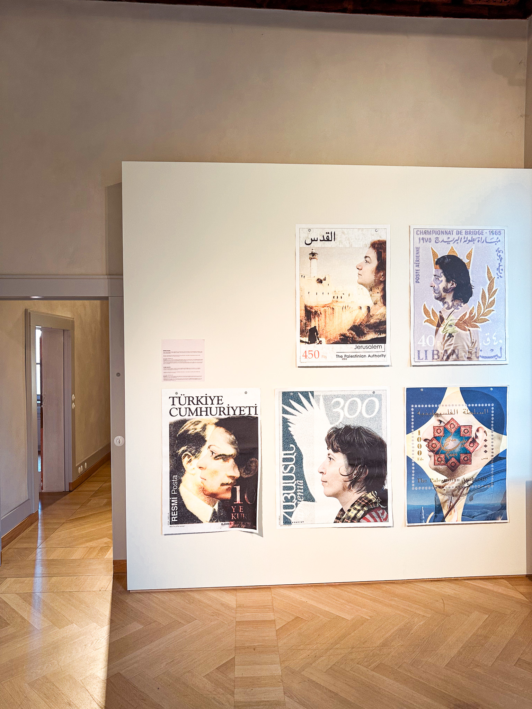