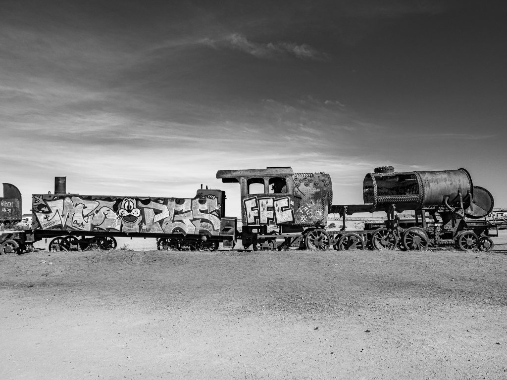

A circa 3 km da Uyuni, si trova questo vero e proprio cimitero dei treni, uno dei più grandi al mondo.  
La prima linea ferroviaria della Bolivia venne inaugurata nel 1899 e collegava proprio Uyuni ad Antofagasta. Da Uyuni, strategicamente vicino al confine con il Cile e, soprattutto, alle miniere di Potosì, i treni partivano carichi di stagno, argento ed oro verso il resto del paese, fino agli anni ’40 quando la linea venne completamente dismessa.

    

    

    

    

Cimitero dei treni, Uyuni, Bolivia, 2019
