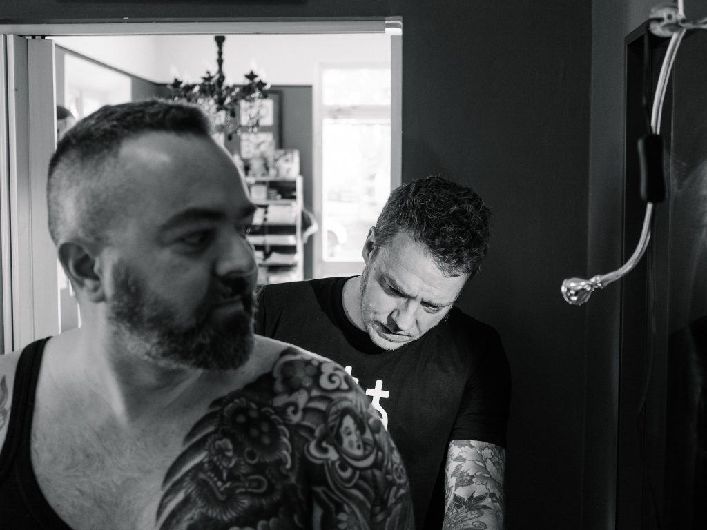

Marco tatua da oltre vent'anni ma non è questo che fa di lui un artista della vecchia scuola. Sono passato [dal suo studio](http://www.lovetattoo.it) di Cavriago un sabato pomeriggio di Aprile e ci siamo messi a chiacchierare mentre lavorava sulla spalla di Alessandro, suo cliente affezionato.

Ho capito che Marco ha iniziato questo mestiere certamente per amore dell'arte, la pittura in particolare, ma anche, e soprattutto, per la curiosità ed il desiderio di stabilire una connessione con l'altro, che fino a pochi anni fa era rappresentato dal diverso. Senza di essa, senza una comunione di valori, non si crea nulla: non si tatua e non ci si fa tatuare, nemmeno dall'artista tecnicamente ineccepibile.

Capite bene come questo approccio sia profondamente distante dai grandi numeri, dalla velocità e dalla superficialità di cui oggi è intriso questo mondo, anch'esso dipendente dalle logiche dei social network.  
Lo studio in cui Marco lavora non fa che riflettere questo punto di vista e gli oggetti che lo popolano testimoniano le relazioni da lui costruite fino ad oggi con l'arte, la spiritualità, la famiglia, se stesso e gli altri.

Grazie a Marco per questa esperienza (chissà magari anch'io un giorno) e grazie ad Alessandro per la disponibilità e la pazienza.

    

    

    

    

    

    

    

    

    

