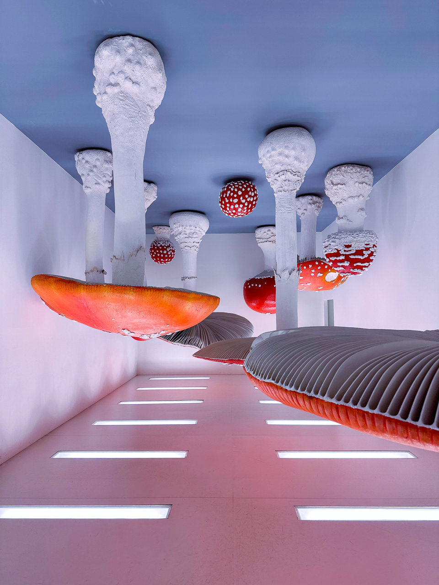
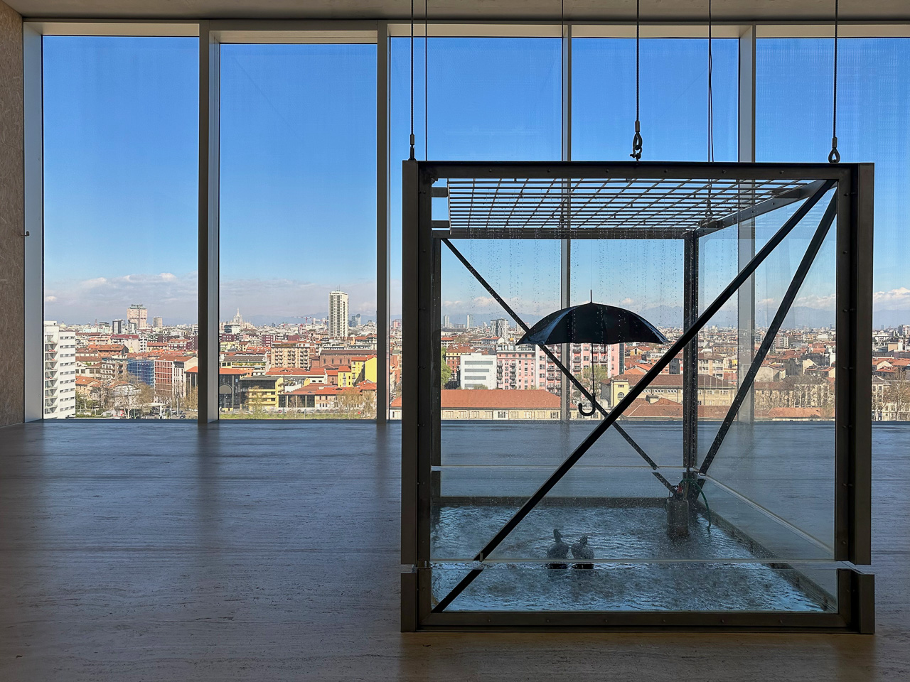
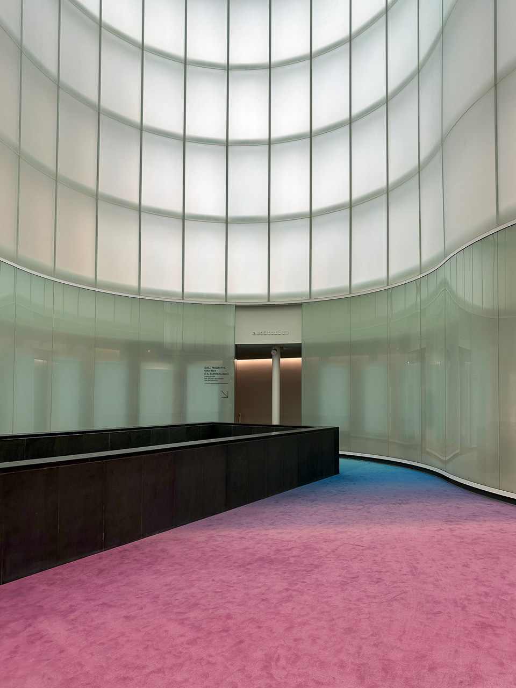

Io e Milano, la città in cui sono nato e ho vissuto per trent'anni, abbiamo un rapporto altalenante: ci ho sempre vissuto bene, intendiamoci, ma quando è stato il momento di decidere cosa fare da grande, ho preferito spostarmi in Emilia, un luogo che trovo più equilibrato e vicino al mio modo di concepire la vita.
Milano ti dà molto ma ti richiede altrettanto, oggi più che mai, così ho deciso di godermela da turista, potendola raggiungere in un'ora e mezza di auto (o 50' di treno, se i prezzi di un Frecciarossa non fossero diventati proibitivi).

Lo scorso weekend io e Consuelo abbiamo proprio fatto i turisti, visitando la città in occasione dell'inaugurazione di due mostre: "Cere Anatomiche" alla [Fondazione Prada](https://www.fondazioneprada.org) e "Dalì, Magritte, Man Ray e il Surrealismo" al [Museo delle Culture](https://www.mudec.it/).

Ho raccolto qualche scatto fatto con l'iPhone delle mostre permanenti della Fondazione, oltre all'*instgrammabilissimo* ingresso alle sale espositive del Mudec.  
Qualche link interessante, prima della galleria:

- [I corpi di Cronenberg nel ‘700](https://www.rivistastudio.com/cere-anatomiche-mostra-fondazione-prada/)
- [Dentro la Torre di Fondazione Prada a Milano. Le fotografie delle opere e dello spazio](https://artslife.com/2018/05/02/dentro-la-torre-di-fondazione-prada-a-milano-le-fotografie-delle-opere-e-dello-spazio/)
- [Scoprendo la collezione permanente di Fondazione Prada, Upside Down Mushroom Room di Carsten Höller](https://insideart.eu/2022/01/17/fondazione-prada/)
- [Quando il Novecento era surrealista](https://www.thewaymagazine.it/leisure/quando-il-novecento-era-surrealista/)

 e Michael Heizer")

 di Betye Saar")
