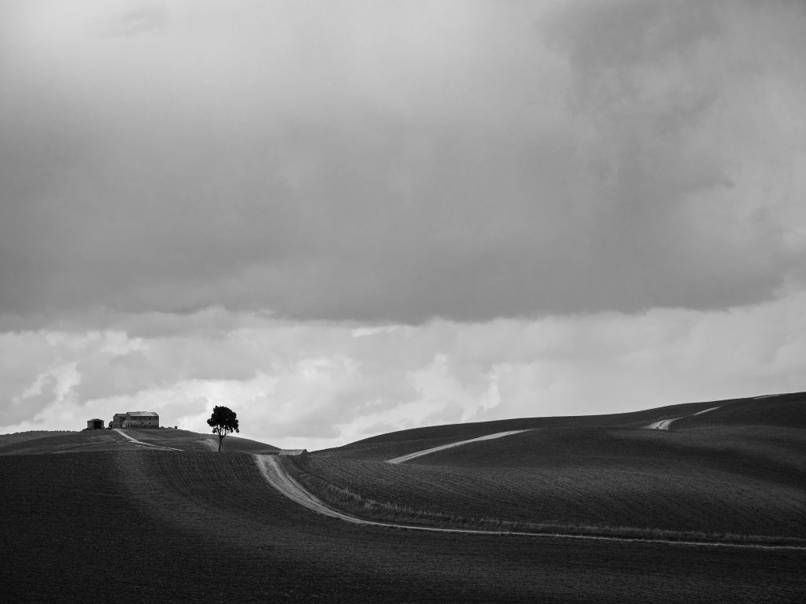
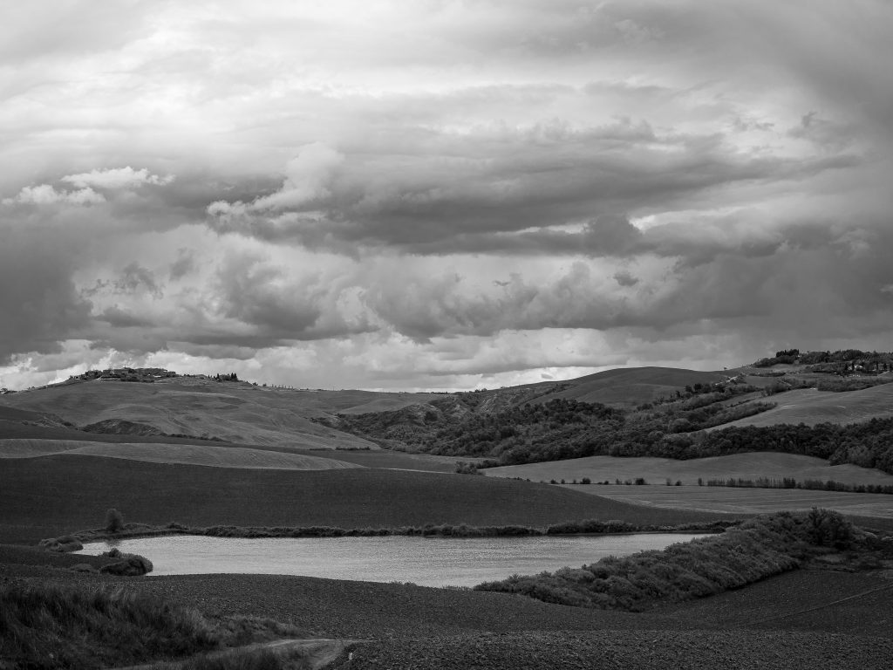
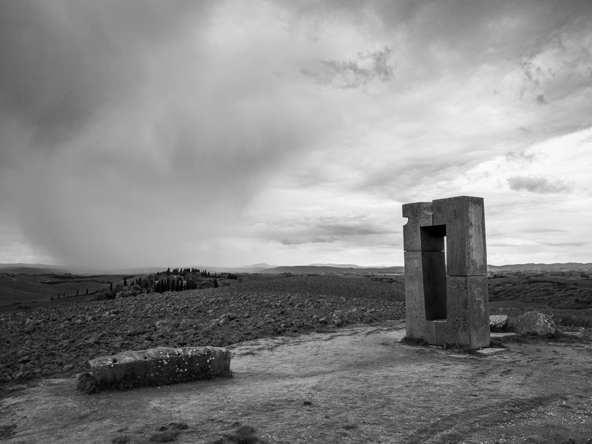
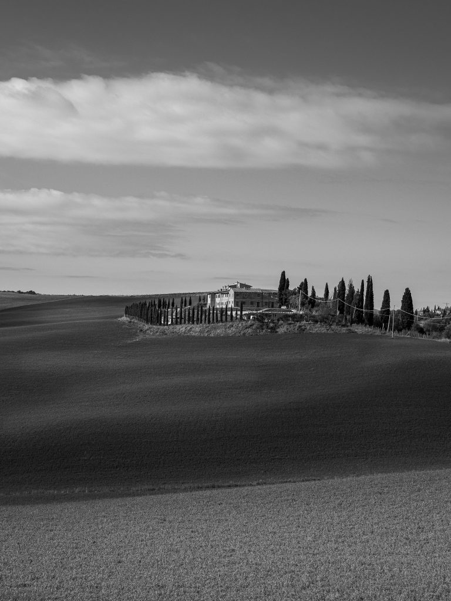
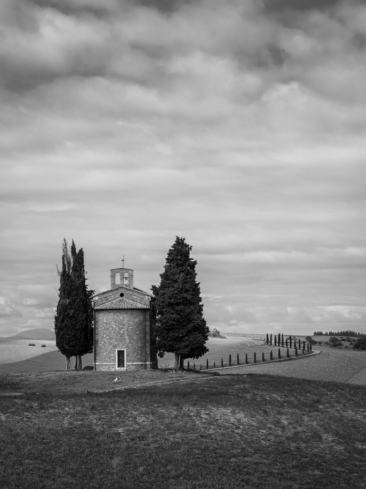
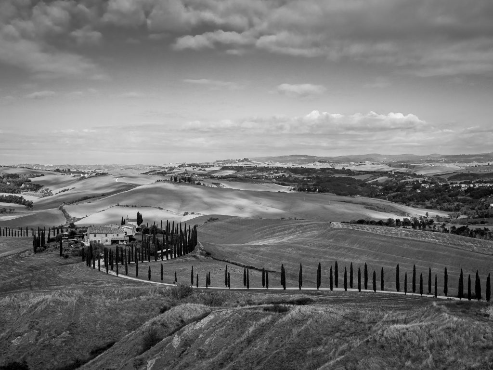

14 giorni, 4 regioni, 2.475 km: questa, in sintesi, la nostra vacanza randomica 2020. Prima tappa in Val d'Orcia, dove i colori intensi tipici dei mesi estivi hanno lasciato il posto alle tinte cupe autunnali. Da qui la scelta di virare verso il bianco e nero, dando prevalenza a forme e chiaroscuri.

