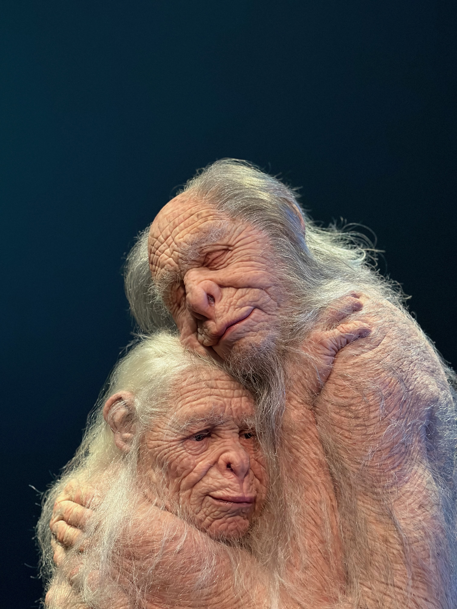
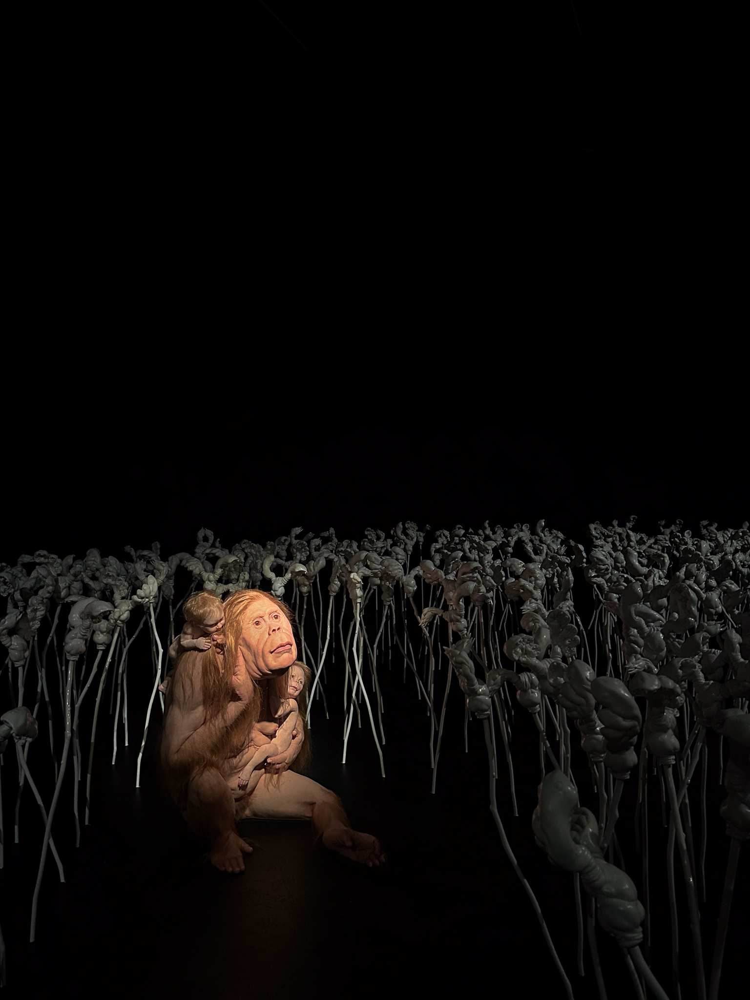

Durante la nostra breve [vacanza olandese](https://www.lucamondini.it/immagini/architetture-di-eindhoven/), il giorno di Pasqua abbiamo preso il treno e in un'ora siamo scesi alla stazione di Rotterdam Centraal.
Dopo una breve passeggiata per il centro della città, siamo entrati al [Kunsthal Museum](https://www.kunsthal.nl/en/), uno dei principali musei olandesi, che, in quei giorni, ospitava ben sette mostre. Di queste, una ci ha colpito molto: Metamorphosis di Patricia Piccinini.

L'artista australiana, di origini italiane, esplora la possibilità di una coesistenza armoniosa tra esseri umani, natura e tecnologia. Lo fa con sculture di grande realismo, fatte di silicone, fibra di vetro e capelli umani: umanoidi, esseri ibridi, così diversi da noi eppure così simili.
Con la sua arte, la Piccinini immagina un possibile futuro condiviso e pone domande come: cosa significa essere umani? Cos'è la diversità? Qual è il limite della scienza nell'alterazione del corpo umano?

Sanctuary rappresenta due creature anziane in un tenero ed intimo abbraccio. L'opera di ispira ai bonobo, scimmie estremamente pacifiche e sessualmente molto attive che stanno rischiando l'estinzione a causa della distruzione del loro habitat e del bracconaggio e invita a riflettere sulla situazione ambientale e a combattere lo stereotipo che l'amore sia solo umano e giovanile.

La scultura che più mi ha colpito è però Kindred: in una stanza buia, piena di strani fiori, troviamo illuminata una madre con quelli che sembrano essere i suoi figli. L'artista [la descrive](https://www.artshub.com.au/news/reviews/review-patricia-piccininis-curious-affection-at-qagoma-255583-2359277/) così:
> In quest'opera, vediamo tre individui unici, ciascuno collocato in un punto diverso di un continuum di maggiore o minore "animalità"... il punto non è la loro differenza, ma la loro connessione.

Un'[artista](https://www.patriciapiccinini.net/) interessante, le cui opere meritano di essere viste e spiegate anche ai ragazzi, vista l'attualità dei temi trattati.