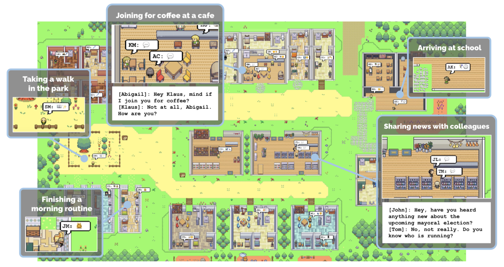
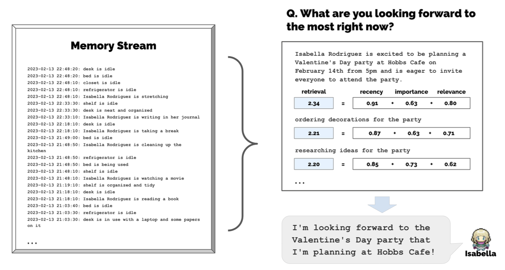

Tra le infinite ramificazioni delle tecnologie di intelligenza artificiale generativa, mi ha recentemente colpito [una ricerca](https://arstechnica.com/information-technology/2023/04/surprising-things-happen-when-you-put-25-ai-agents-together-in-an-rpg-town/) portata avanti dall'Università di Stanford in collaborazione con Google. In breve, il gruppo di ricercatori ha creato una piccola città virtuale, chiamata Smallville, in cui 25 personaggi guidati da ChatGPT e da un meccanismo che simula il flusso della memoria (ci torneremo) si muovono, comunicano e interagiscono tra loro, portando avanti i compiti che sono stati loro assegnati:

> Gli agenti generativi si svegliano, preparano la colazione e si recano al lavoro; gli artisti dipingono e gli autori scrivono; formano opinioni, si accorgono l'uno dell'altro e avviano conversazioni; ricordano e riflettono sui giorni passati mentre pianificano il giorno successivo.

Ad ognuno di questi personaggi è stata assegnata preventivamente un'identità, scritta in linguaggio naturale, come base della propria memoria e che include dettagli come la loro occupazione principale e il tipo di relazione con gli altri personaggi.

La parte affascinante è che, per aggirare le limitazioni legate alla quantità di token processabili dai Large Language Model, è stato disegnato un meccanismo che, da un lato, consente di archiviare in un vero e proprio flusso della memoria le percezioni che i personaggi acquisiscono dall'ambiente circostante; dall'altro, permette agli stessi personaggi di recuperare i "ricordi" passati in base alla rilevanza, all'importanza e alla vicinanza cronologica e di utilizzarli per pianificare ed eseguire azioni, oltre che creare nuove riflessioni e nuovi ricordi.

A mano a mano che la simulazione procedeva, i ricercatori hanno osservato tre comportamenti emergenti, non esplicitamente programmati ma frutto delle interazioni tra gli agenti:

1. Diffusione delle informazioni: gli agenti propagano le informazioni acquisite, dialogando tra loro.
2. Memoria delle relazioni: gli agenti formano nuove relazioni nel tempo e ricordano le loro interazioni passate con gli altri agenti.
3. Coordinamento: gli agenti si coordinano tra di loro per pianificare e realizzare progetti.

Nell'ambito della ricerca, alcuni valutatori umani hanno osservato i replay della simulazione, valutando perfettamente credibile il comportamento degli agenti, sulla base dell'ambiente e delle esperienze vissute.

Questo tipo di architetture, potenzialmente utilizzabili in ambiti che vanno al di là del gaming come, ad esempio, la progettazione di ambienti immersivi o lo studio delle dinamiche sociali, non sono ovviamente esenti da problemi, anche di natura etica e sociale. Gli autori dello studio ne citano alcuni, primo tra tutti il rischio che le persone instaurino con gli agenti [relazioni parasociali](https://en.wikipedia.org/wiki/Parasocial_interaction), attribuendo loro emozioni umane (torna l'antropomorfismo di cui [si parlava](https://www.lucamondini.it/parole/ambiguita-di-fondo/) qualche settimana fa).

Il paper è disponibile [qui](https://arxiv.org/pdf/2304.03442.pdf).