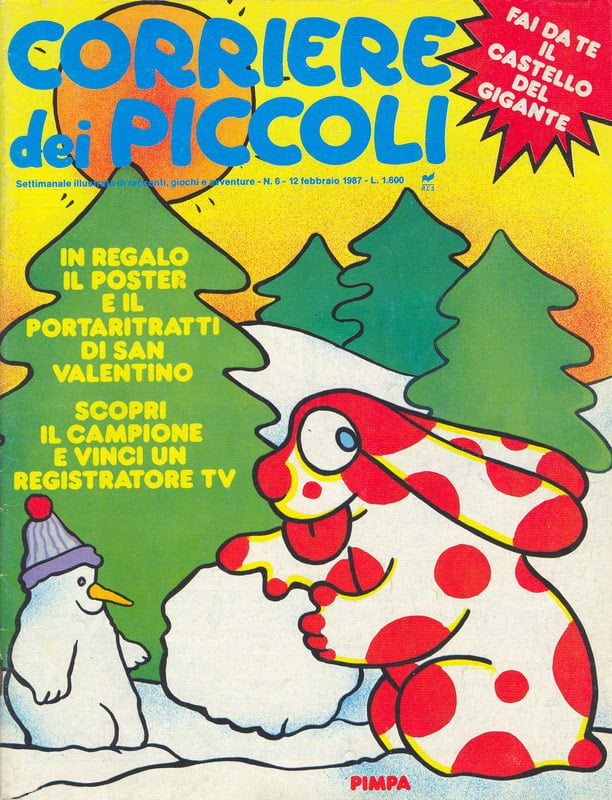

Mio nonno Angelo detto Angiòl non poteva che chiamarsi così. Era un omone grande e grosso, con le orecchie pronunciate (chissà da chi avrò preso le mie?) e la pelle segnata dal sole. Era pacato e gentile e, da ciò che mi raccontano, non ha mai alzato la voce una sola volta nella vita.

Il Sabato, giorno di mercato, si svegliava presto per andare in paese a sbrigare le commissioni che mia nonna gli affidava. Non avendo la patente, si muoveva su di un vecchio motorino sgangherato il quale, lo ricordo bene, non si avviava mai al primo colpo. Dalla finestra della camera lo osservavo mettersi dei fogli di giornale sotto la giacca per non prendere freddo e provare ad accendere quel suo cavallo argentato e indomabile che, per tutta risposta, borbottava sputando fumo.  
Rientrava un paio d'ore più tardi portando le borse della spesa, le ultime novità dal paese e, sotto braccio, Grand Hotel per mia nonna e il Corriere dei Piccoli per me.

Sono alto più di un metro e novanta ma, quando mi dicono "sei tale quale a tuo nonno", sono certo di superare i due metri.