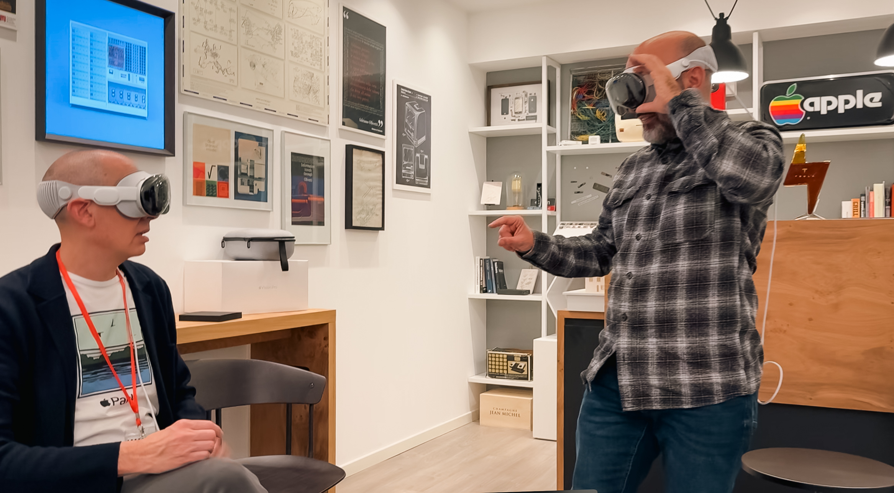

Dopo uno scambio acrobatico su LinkedIn tra Silicon Valley, Reggio Emilia e Trezzo sull’Adda, qualche giorno fa, insieme all’amico [Piergiorgio](https://www.linkedin.com/in/pierg/?lipi=urn%3Ali%3Apage%3Ad_flagship3_pulse_read%3BPDbCxU4kTx2INx%2FoDoGafg%3D%3D), ho passato un pomeriggio a provare gli Apple Vision Pro, ospiti di [Damiano](https://www.linkedin.com/in/damianoairoldi/?lipi=urn%3Ali%3Apage%3Ad_flagship3_pulse_read%3BPDbCxU4kTx2INx%2FoDoGafg%3D%3D).

Alcune premesse:

- Non avevo grandi esperienze pregresse con device di AR/VR/MR; ero quindi quasi completamente a digiuno di questo mondo.
- Porto gli occhiali da oltre vent’anni a causa di una leggera miopia combinata ad un altrettanto leggero astigmatismo. Nulla di particolarmente impattante ma, diciamo, non ho potuto vivere l’esperienza in maniera ottimale.
- Il visore era in modalità guest, ciò significa che alcune funzioni come EyeSight e Persona non erano disponibili. Poco male, c’era così tanto da esplorare.

L’oggetto in sé è un capolavoro di ingegneria: vi invito, se non l’avete già fatto, a vedere cosa sono riusciti [a farci stare](https://www.apple.com/apple-vision-pro/specs/) in un dispositivo che, tutto sommato, non mi è parso poi così ingombrante.

Una volta indossato, l’ho trovato abbastanza confortevole anche se l’imbottitura intorno agli occhi non era probabilmente quella più adatta al mio profilo. Apple ne mette a disposizione una trentina e la scelta avviene grazie alla scansione 3D del viso in fase di ordine.

A posteriori, forse ho stretto un po’ troppo la fascia intorno alla testa (la già iconica Solo Knit Band) ma, data la mia inesperienza, avevo l’ansia che potesse cadermi.

La batteria esterna, che ha fatto arricciare il naso a molti, non mi ha dato invece nessun tipo di fastidio: dopo averla messa nella tasca della giacca, me ne sono semplicemente dimenticato.

Adesso viene il bello. Diciamo che non rappresento esattamente l’utente medio: negli scorsi mesi e, soprattutto, nelle ultime settimane, ho letto molto di questo prodotto quindi conoscevo già bene i meccanismi della UX e le logiche sottostanti. Ciò nonostante, la mia prima reazione è stata calma e pacata come [quella di David Letterman](https://youtu.be/IHDvUU0tCBY?si=Gwc1zck4oSLu4Hln&t=80) 😂. Cosa mi ha impressionato maggiormente?

- L’**eye tracking**, il sistema di navigazione attraverso lo sguardo, funziona così bene che ha del miracoloso per rapidità e precisione. E’ incredibile vedere gli elementi grafici evidenziarsi uno dopo l’altro, di pari passo con i movimenti impercettibili della pupilla. Occorreranno certamente nuove heatmap per capire come riorganizzare i contenuti ed informazioni all’interno delle applicazioni.
- La definizione e la **nitidezza** degli oggetti e, ancora di più, la loro **immobilità** rispetto all’ambiente reale circostante. Potevo ruotare velocemente la testa in ogni direzione che le finestre o i modelli 3D rimanevano incollati, lì dove li avevo messi. Mai un’indecisione o un semplice sfarfallio.
- L’**interazione tra virtuale e reale**: applicazioni che disegnano luci e ombre sull’ambiente reale e, viceversa, risentono dell’illuminazione circostante. Anche qui mi aspetto un gran lavoro da parte dei designer nel tenere conto di questa relazione: come gestisco, ad esempio, il testo se deve essere chiaro e leggibile in ombra così come contro luce? Lo stesso discorso può essere fatto dal punto di vista funzionale: può un’applicazione beneficiare del luogo in cui viene fruita?
- Non ho mai avuto la sensazione di essere isolato da chi stava intorno a me, a meno che non lo volessi. Le frequenti battute con Damiano che ci guidava pazientemente, osservandoci divertito, lo testimonia. Penso che la Digital Crown, la ghiera che ti consente di scegliere il livello di **immersività**, sia un modo intelligente di farti sentire sempre in controllo.
- L’**audio** è davvero buono ed avvolgente, nonostante la dimensione dei driver. Ovviamente, se si ha bisogno di privacy, occorre utilizzare le AirPods Pro.
- La consistenza della UX rispetto all’**ecosistema Apple**: usando il visore, ho avuto la sensazione che tutto tornasse, che le scelte in questo ambito fossero la sintesi del percorso fatto dal primo iPhone ad oggi.

Nei quaranta minuti circa di test, ho visto un filmato in 3D dove una farfalla si è posata sulla mia mano e un dinosauro ha cercato di strapparmela a morsi, ho smontato un modello di una formula uno e di un modulo lunare, ho girato un video “tridimensionale”, ho camminato sulla luna e allo Yosemite Park. Ho scritto note, navigato sul web e guardato fotografie panoramiche che finalmente avevano senso di esistere. Ho riempito la stanza di finestre ed applicazioni, toccando per la prima volta con mano il concetto di spatial computing.

Tolto il visore, mi sono reso conto però di quanto la realtà sia “più definita”: il mio cervello si era abituato velocemente alla rappresentazione catturata dalle telecamere del Vision Pro che non è altrettanto ricca. In effetti, da specifiche Apple, il display supporta il 92% della gamma colori DCI-P3, ovvero il Vision Pro è in grado di mostrare il 49% dei colori che gli occhi possono effettivamente vedere.

Dal punto di vista fisico, non ho avvertito invece fastidi particolari a parte un leggero calore. Il peso, citato da molti, diventa probabilmente un punto di attenzione dopo un paio d'ore di utilizzo continuativo.

Quindi, in conclusione?

Penso ci si trovi di fronte all’inizio di un nuovo percorso: gli Apple Vision Pro sono la prima iterazione di un prodotto che certamente evolverà nei prossimi anni. Ci sono temi, legati al software, che mi aspetto vengano affrontati nel breve termine. Penso, ad esempio, ad una migliore integrazione con gli altri device o la capacità di ricordare la posizione delle finestre in spazi multipli, così da avere setup diversi tra casa e lavoro. Una critica condivisa da molti è l’incapacità di gestire esperienze condivise tra più persone ma in realtà, spulciando nella documentazione per gli sviluppatori, questa possibilità è già supportata all’interno del [framework SharePlay](https://developer.apple.com/videos/play/wwdc2023/10075/). Dal punto di vista dell’hardware, il cammino sarà certamente più rallentato e non ho idea di quando ci troveremo ad indossare qualcosa di significativamente più compatto.

Per questo credo che, almeno per qualche anno, l’utilizzo sarà prevalentemente in ambito business, come strumento collaborativo e di produttività, più che per l’entertainment personale su larga scala. Trattandosi di Apple però, tutto può accadere!

Ringrazio nuovamente Damiano per l’invito, non vedo l’ora di poterci giocare in modo più approfondito e di conoscere l’opinione di amici e colleghi.