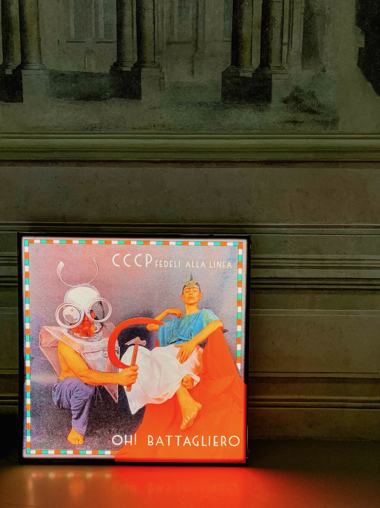
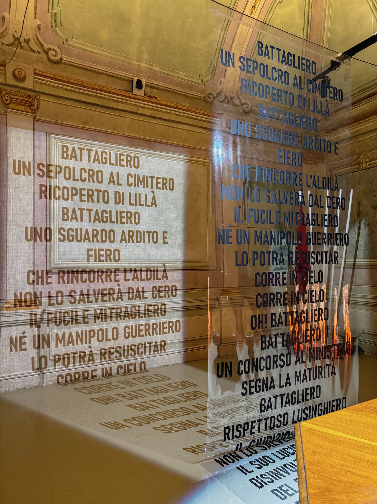
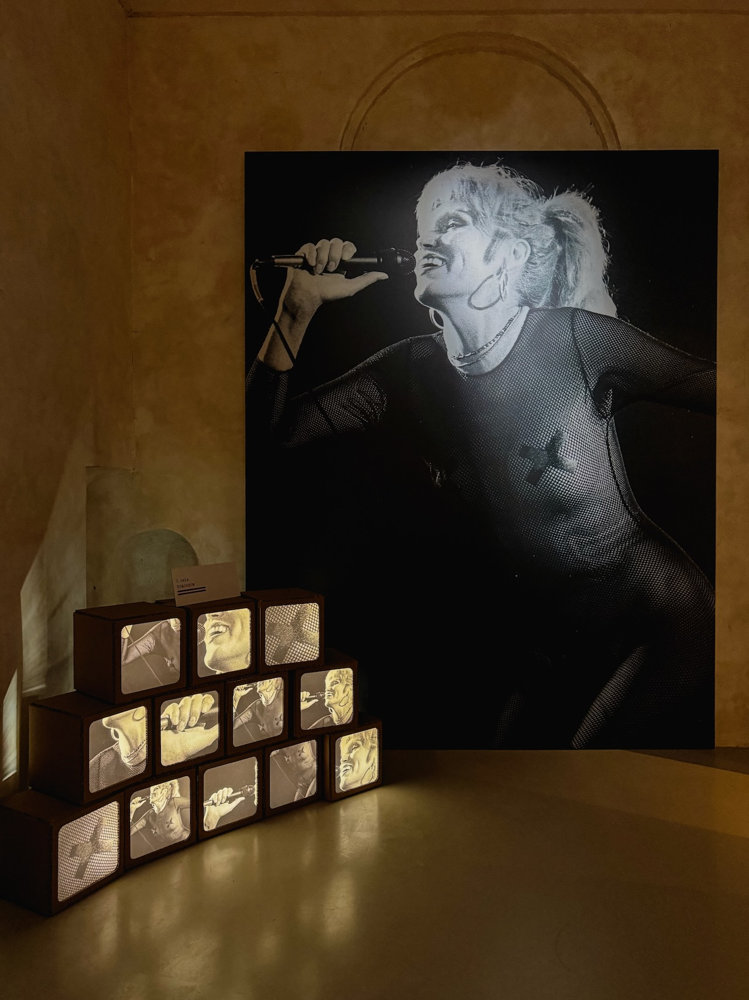
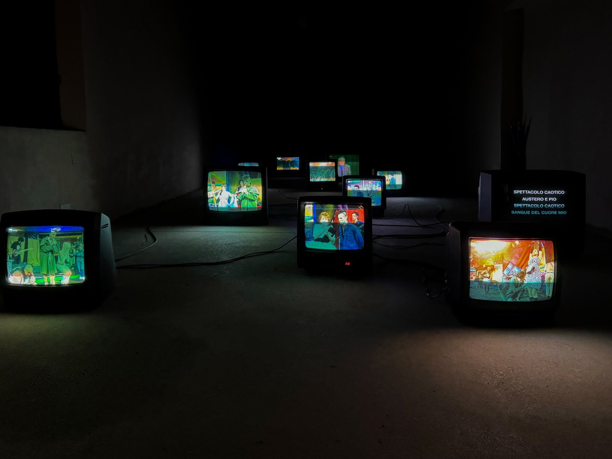
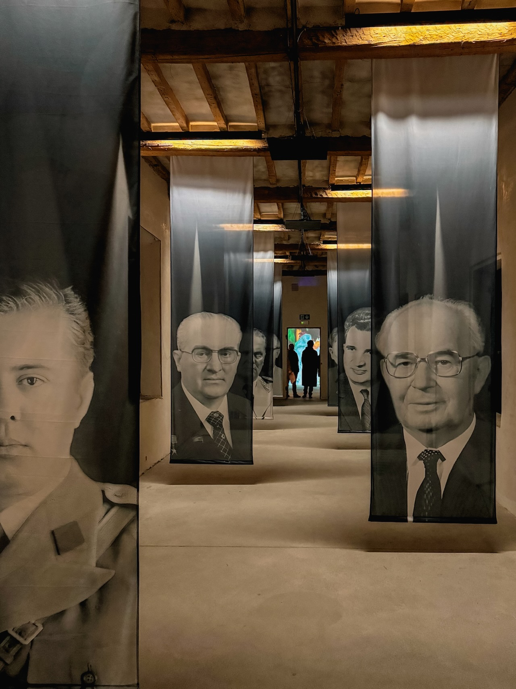
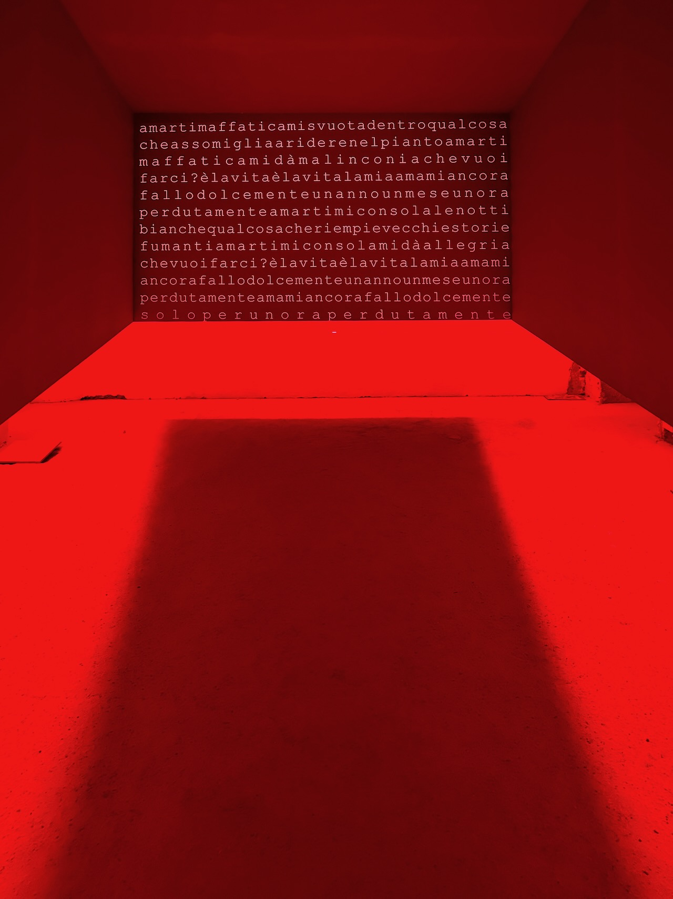
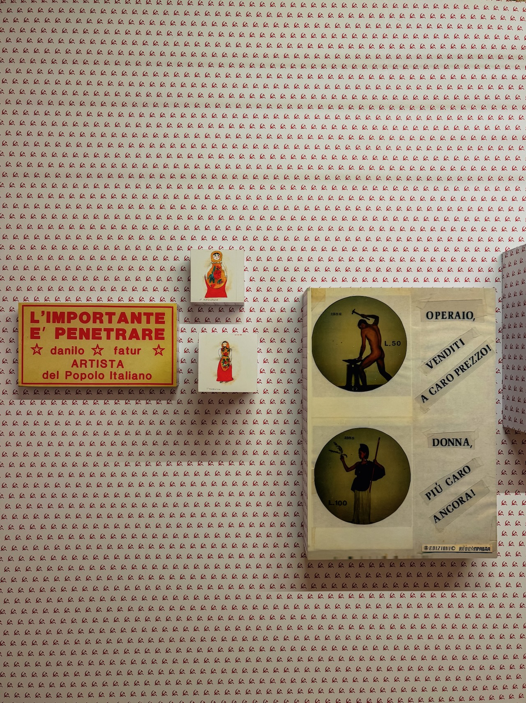
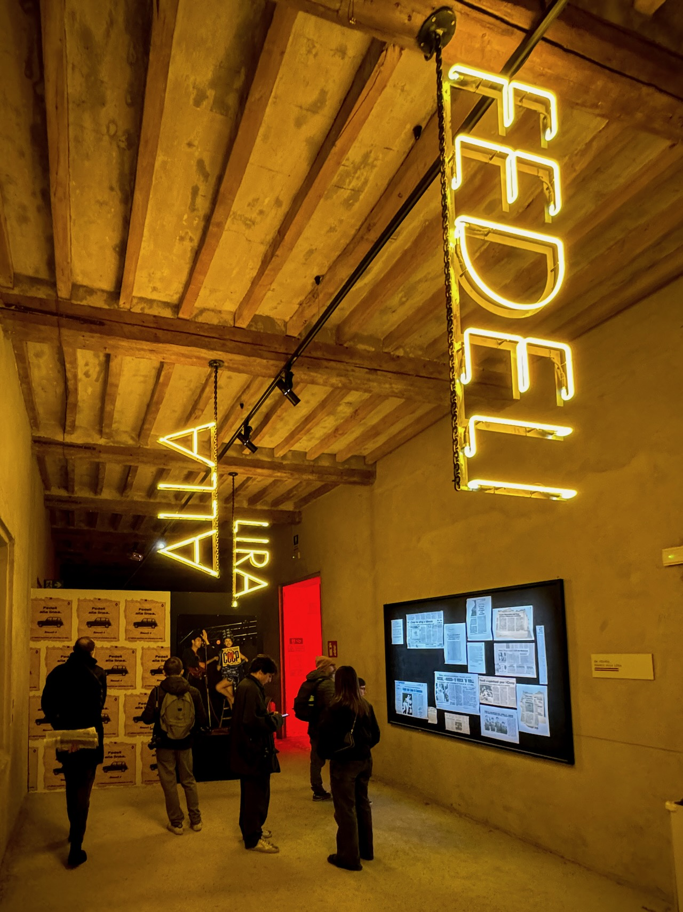
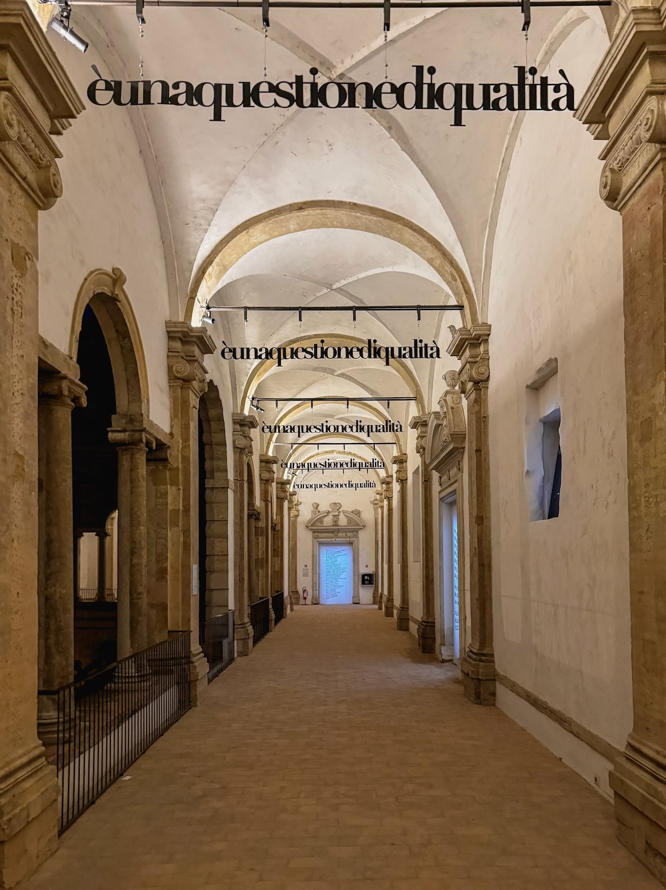
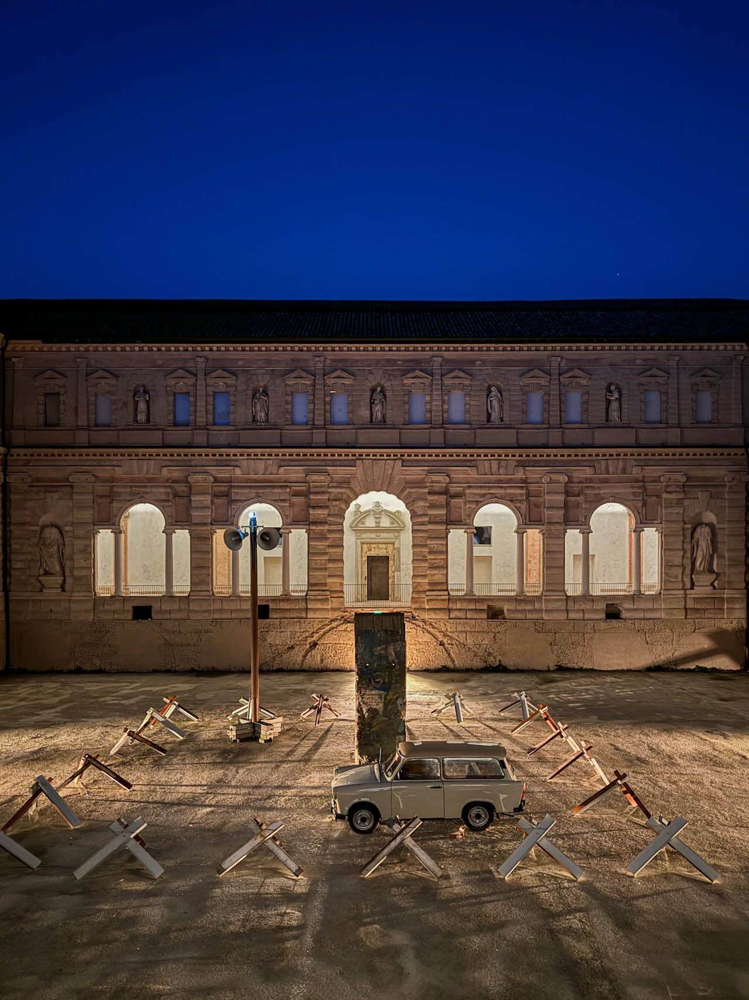



Domenica pomeriggio siamo stati ai Chiostri di San Pietro a vedere la mostra "Felicitazioni! CCCP - Fedeli alla linea 1984 - 2004", dedicata ovviamente alla band punk reggiana, a 40 anni dall'uscita del loro primo EP.

Io ero troppo piccolo quando Ferretti, Zamboni, Giudici e Fatur iniziavano a portare il loro contributo alla scena punk italiana (sono molto più vicino ai CSI, per dire), ma ricordo bene l'entusiasmo di tanti amici più grandi verso quelle sonorità grezze e, soprattutto quei testi. Quei testi che parlavano di Emilia (paranoica), ma anche di Berlino, di URSS, di televisione e di disagio.

Al di là dei gusti musicali vi consiglio senza dubbio di spenderci un paio d'ore perché la mostra è pensata bene e realizzata ancora meglio, con fotografie, video, installazioni, costumi e opere d'arte inedite.
Unico appunto: copritevi bene perché i chiostri non sono riscaldati e fa piuttosto fresco in questo periodo!

Felicitazioni! è aperta fino al 12 Febbraio 2024. Trovate tutte le info [qui](https://www.palazzomagnani.it/exhibition/felicitazioni-cccp-fedeli-alla-linea-1984-2024/).

