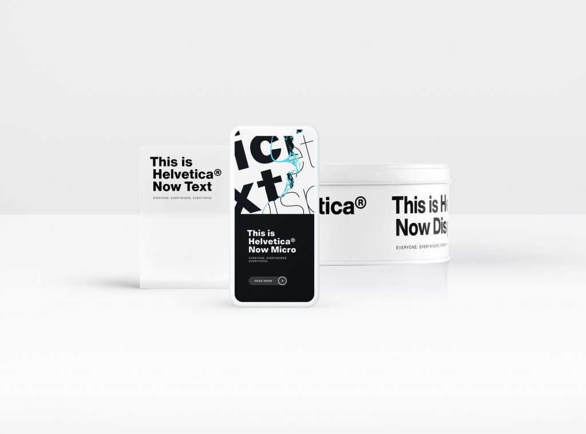

Non deve essere facile aggiornare quello che, secondo i più, è il carattere più famoso e utilizzato al mondo eppure [Monotype](https://www.monotype.com), lo studio che ne detiene i diritti, è riuscito nell'impresa.  
In questi giorni è stato infatti presentato [Helvetica Now](https://www.monotype.com/fonts/helvetica-now/), redesign dell'iconico font a distanza di 35 anni dalla precedente iterazione.

Tre le versioni presentate, Micro, Text e Display, che ne migliorano l'usabilità e la duttilità, senza rinnegare i tre principi alla base dell'idea originale di Max Miedinger: chiarezza, semplicità, neutralità.

- **Micro** si adopera per migliorare la leggibilità nelle dimensioni più piccole (da 4 a 7 punti), spesso utilizzate per i contenuti fruiti da smartphone, smartwatch e tablet.
- **Text**, il vero cavallo di battaglia della famiglia, è fatto per essere stampato su carta e offre un'ampia gamma di pesi con spaziatura e crenatura rifinite.
- **Display** è pensato per i designer che lavorano a oggetti di grande dimensione, come i poster.



> "Today, we’re asking Helvetica to do more than it ever has before. Previous versions of the typeface weren’t designed to be used in graphic applications that have developed over the last 30 years. As a result, older versions of the font were lacking in some important areas.
> 
> \[...\]
> 
> Helvetica Now solves the legibility and style challenges that brands using Helvetica have consciously and unconsciously faced for years. The design introduces a new chapter in the Helvetica story—expanding its look and utility while reinvigorating its heritage."
> 
> Charles Nix, type director in Monotype.

Benvenuto Helvetica Now!

Link:

- [https://www.macitynet.it/font-helvetica-now-rivoluzione/](https://www.macitynet.it/font-helvetica-now-rivoluzione/)
- [https://www.creativeboom.com/resources/monotype-launches-the-first-redesign-in-35-years-of-the-worlds-most-ubiquitous-font-helvetica/](https://www.creativeboom.com/resources/monotype-launches-the-first-redesign-in-35-years-of-the-worlds-most-ubiquitous-font-helvetica/)
- [https://www.creativeboom.com/resources/monotype-launches-the-first-redesign-in-35-years-of-the-worlds-most-ubiquitous-font-helvetica/](https://www.creativeboom.com/resources/monotype-launches-the-first-redesign-in-35-years-of-the-worlds-most-ubiquitous-font-helvetica/)
