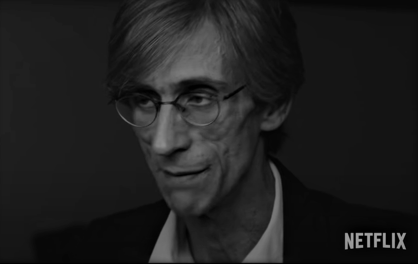

Questa mattina ho approfittato di un po' di tempo libero per mettermi in pari con le newsletter a cui sono iscritto. Ne seguo diverse - prima o poi ne parlerò qui - e, tra di esse, c'è anche Altre/Storie di [Mario Calabresi](https://www.mariocalabresi.com/). Nell'ultimo numero si parla anche di Fabio Cantelli Anibaldi, uno dei protagonisti di [SanPa](https://www.netflix.com/title/81010965), il documentario di Netflix sulla comunità di San Patrignano.

Le sue interviste sono quelle che mi hanno colpito di più per il linguaggio preciso e tagliente come i tratti del suo viso. Nella conversazione con Calabresi, Cantelli riprende una riflessione interessante sul tempo e su come alcune esperienze particolarmente potenti ne modifichino la percezione. Lo chiama "tempo verticale", in contrapposizione alla orizzontalità con la quale siamo soliti descrivere il flusso delle nostre vite:

> **Il tempo verticale è il tempo legato a delle emozioni particolari, che scavano dentro di noi e ci segnano**, che ci hanno rivelato qualcosa di fondamentale su noi stessi. Sono emozioni indimenticabili. È un passato che non passa mai del tutto, che è sempre lì in attesa, in agguato, pronto a riemergere per colpirti alle spalle e dirti: “Io non ti lascerò mai stare perché tu sei in me".
> 
> F. Cantelli

Temo che molti si troveranno ad affrontare la verticalità di questo ultimo anno: chi più chi meno, in modalità che probabilmente oggi è prematuro ipotizzare. Starà ad ognuno di noi trovare il modo capitalizzare questa esperienza.
