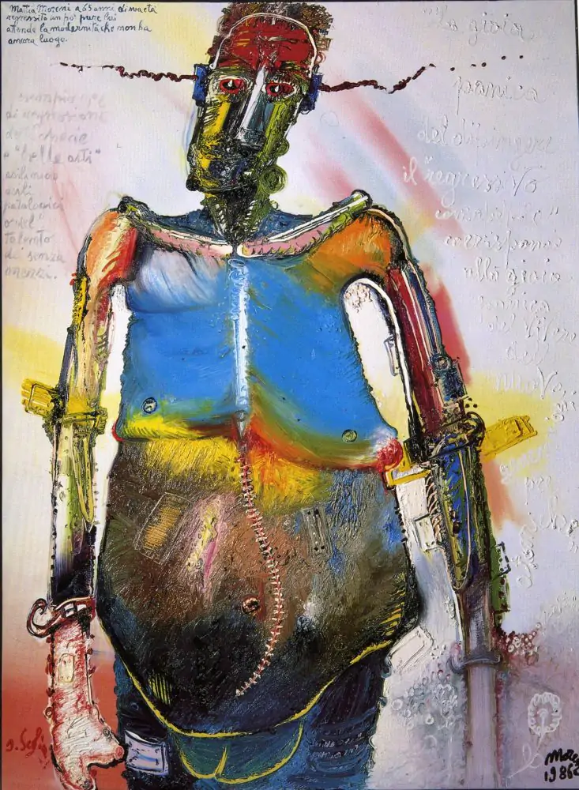

Questa mattina siamo usciti di casa sotto un nevischio fine e ci siamo diretti in centro a Reggio (Emilia).
Era un po' che volevo andare a vedere la mostra "[L'arte inquieta. L'urgenza della creazione](https://www.palazzomagnani.it/exhibition/larte-inquieta/)" a Palazzo Magnani ma Consuelo non era molto dell'idea. Entrambi siamo attratti dall'arte moderna più che da quella classica e, nonostante la profonda ignoranza in materia, appena possibile visitiamo le mostre che incrociamo con grande curiosità.

L'esposizione in questione, aperta fino al 12 Marzo, raccoglie in cinque stanze tematiche le opere di autori che hanno espresso la loro creatività, partendo dalla propria realtà interiore: esponenti delle avanguardie di inizio '900 in dialogo con opere provenienti da mondi esclusi, come quello dell'[art brut](https://it.wikipedia.org/wiki/Art_Brut). Fondamentale il contributo dell'Archivio del San Lazzaro del [Museo di Storia della Psichiatria di Reggio Emilia](https://www.musei.re.it/collezioni/museo-di-storia-della-psichiatria/), oggi una tra le maggiori collezioni nel campo in Europa.

Questo continuo e inquieto desiderio di ricerca che esprime bene Anselm Kiefer in una delle citazioni di controno alle opere:
> Ero attratto dall'idea del Santo Graal come qualcosa di lontano ed enigmatico, una sorta di destinazione che si desidera disperatamente raggiungere, ma si sa che non si arriverà mai. Questo senso di desiderio si è manifestato molto presto nella mia vita. E ľ'arte è desiderio.  
> Non si arriva mai, ma si continua ad andare avanti nella speranza di riuscirci.  
> \- Anselm Kiefer

Alcune opere mi hanno colpito molto, una tra tutte l'autoritratto n° 3 di Mattia Moreni, anzi "Mattia Moreni a 65 anni di sua età. Autoritratto n.3": un dipinto di oltre due metri e mezzo d'altezza, in cui l'autore si ritrae in parte uomo e in parte robot, mostrando una ipotetica regressione biologica che lascia il posto all'ibridazione con le macchine. Dipinto nel 1986, l'ho trovato modernissimo nel significato e potente nelle modalità, con questi colori vivi e le pennellate spesse.
Mi scuso se qualche esperto o appassionato dovesse legegre queste righe: come dicevo, non ho le competenze per andare oltre quello che la mia sensibilità mi suggerisce. 

Un'altra cosa che mi ha incuriosito è stata una delle ultime stanze, intitolata "cartografie, mappe e mondi visionari" che riunisce, tra le altre cose, rielaborazioni di mappe e cartografie come "Tra Rhodos e Isparta" di Emilio Isgrò, artista siciliano che ha lavorato su un tema assai attuale, quello delle cancellazione.

[Questo articolo](https://www.ilfoglio.it/cultura/2022/02/17/news/cancellare-senza-censurare-l-arte-di-emilio-isgro--3700819/) de il Foglio mi ha aiutato a capirne meglio le intenzioni:

> Nel 2022 il cancellare ha un significato più forte di quello che aveva nel 1964, quando cominciai a fare le prime cancellature, perché ci siamo accorti che un mondo che non cancella le parole quando occorre farlo, vuol dire che le usa a casaccio. Cancellare, quindi, significa riflettere.

Insomma, se passate da Reggio Emilia in questi primi mesi dell'anno, avete un motivo in più per fermarvi.