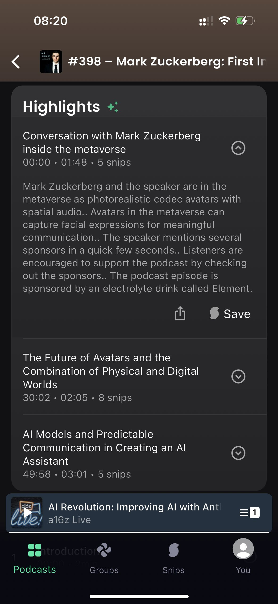
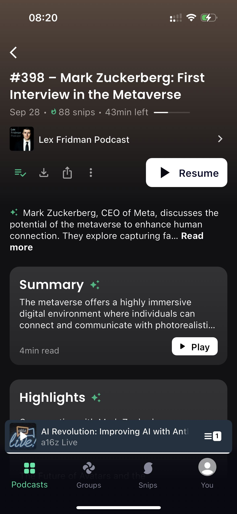
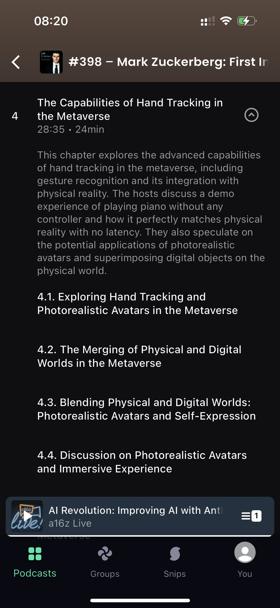

Mi piace ascoltare podcast, soprattutto quando corro o mentre sto guidando. Da quando sono passato alla mela, mi accontento di Apple Podcast che ha tutte le funzioni principali e supporta la sincronizzazione tra dispositivi.

In questo momento però mi ritrovo ad ascoltare soprattutto materiale in inglese di una certa durata con la volontà di salvarmi i passaggi più interessanti.
Sto testando quindi [Snipd](https://www.snipd.com/) che, con un click, permette di fare proprio questo: salvare porzioni di episodio per poi condividerle con la community o con i tool di hashtag#pkm preferiti (Obsidian, Notion, …).

Grazie all’immancabile IA, snipd genera inoltre la trascrizione, il riassunto e suddivide la puntata in capitoli sulla base degli argomenti trattati.
Per quel che ho visto finora, funziona molto bene; spero solo che in futuro supporti contenuti in altre lingue.
Mi aspetto comunque che altri player, Spotify in primis, seguano la stessa strada.

