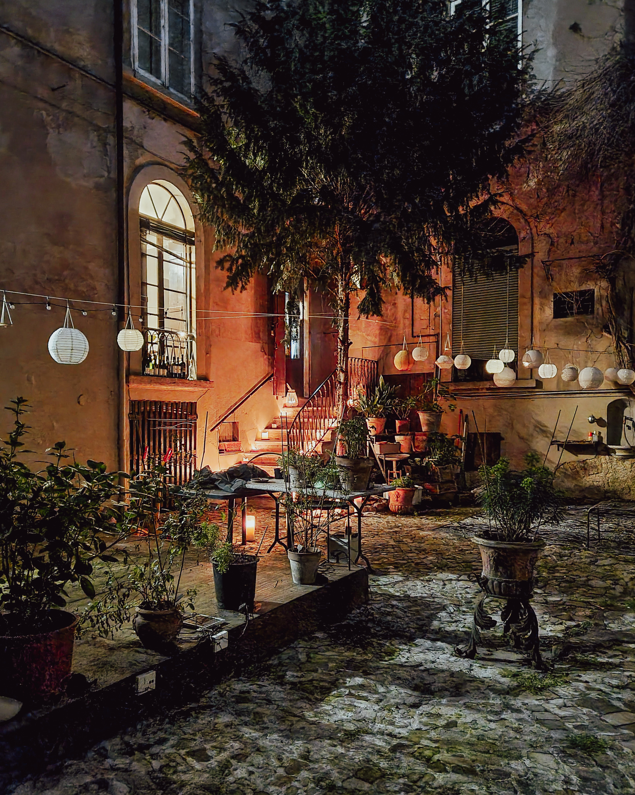
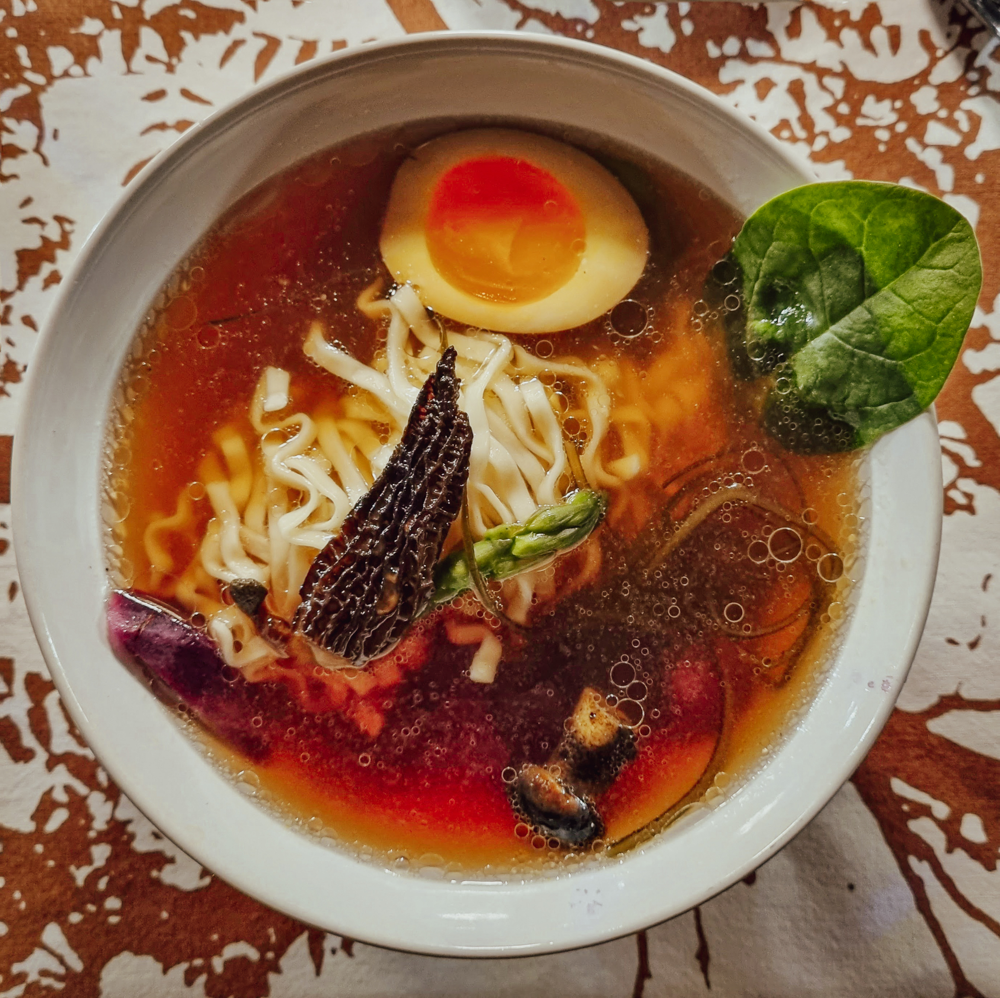

Per una serie di circostanze, dovute soprattutto al percorso lavorativo di Consuelo, abbiamo conosciuto [Giancarlo Destro](https://www.instagram.com/veggychappy/), chef di lungo corso che da qualche anno ha aperto il proprio home restaurant qui a Reggio Emilia. 
In queste settimane, Giancarlo propone tutti i venerdì sera una social dinner a base di cucina giapponese, una delle sue grandi passioni. Il menù è prettamente vegetale e di stagione, preparato secondo le varie declinazioni della cucina nipponica.
Venerdì scorso arriviamo dunque con cinque minuti di anticipo rispetto all'orario previsto di fronte a Palazzo Fontanelli-Ceretti, con il suo sobrio disegno rinascimentale risalente alla prima metà del XVI secolo, all’angolo fra via Roma e via Dante.

Attraversiamo il suggestivo cortile interno ed entriamo in casa. Siamo i primi, Giancarlo ci accoglie e ci fa accomodare in sala da pranzo: una bella tavolata apparecchiata in modo semplice ma con gusto, musica di sottofondo, luci soffuse.  
Nell'arco di dieci minuti, ci raggiungono gli altri ospiti, forse l'incognita principale della serata: al netto di un paio di occasioni, non avevamo mai condiviso la tavola con sconosciuti e, col senno di poi, devo dire che siamo stati davvero fortunati. Abbiamo incontrato persone piacevoli e interessanti, capaci di solleticare il mio perenne desiderio di serendipità.

Come cerco di fare sempre più spesso, ho lasciato il telefono nella borsetta di Consuelo (le due foto di questo post sono sue) e non ho fotografato nessuno dei piatti, squisiti, proposti da Giancarlo. Sebbene cerchi di limitare il consumo di carne, non sono vegetariano, né tanto meno esperto di cucina giapponese ma amo il cibo, sono curioso e aperto all'esplorazione gastronomica.  
Posso dire che la cena è stata eccellente: piatti ben presentati, sapori e consistenze sempre in armonia tra loro. Giancarlo ci ha presentato ogni piatto con passione, spiegandone gli ingredienti e raccontando le complesse preparazioni. Oltre al riso bianco aromatizzato con aceto di riso, mi hanno colpito in particolar modo il _kinpira gobo_, a base di radice di bardana e carote con sesamo, e il _daikon no nimono_, uno stufato di daikon alla salsa di miso.

Se abitate in zona, vi invito a seguire Giancarlo sui suoi [canali](https://www.instagram.com/veggychappy/) [social](https://www.facebook.com/VeggyChappy/) e a partecipare agli eventi che organizzerà in futuro. Magari ci incontriamo.