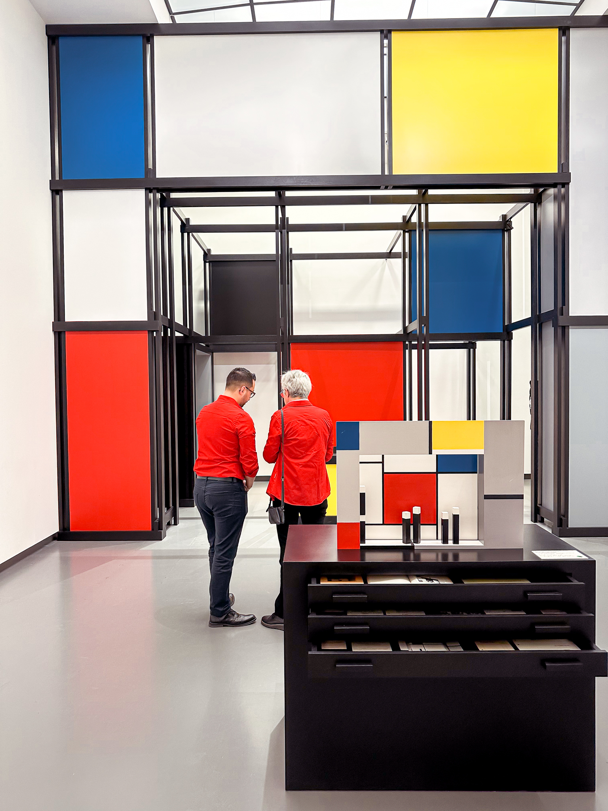
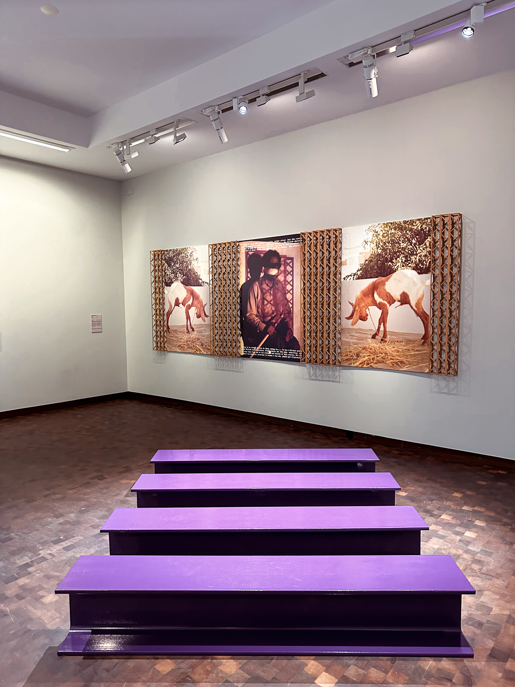
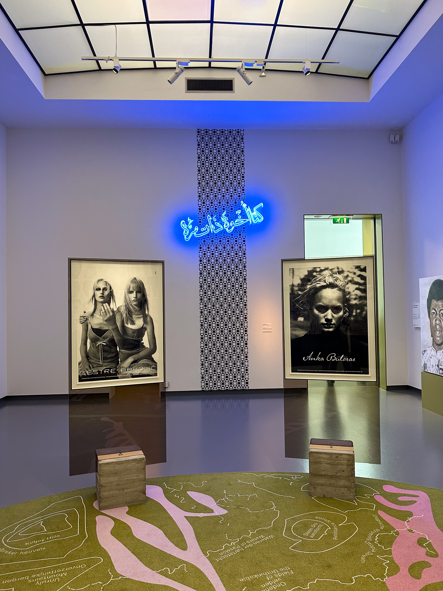
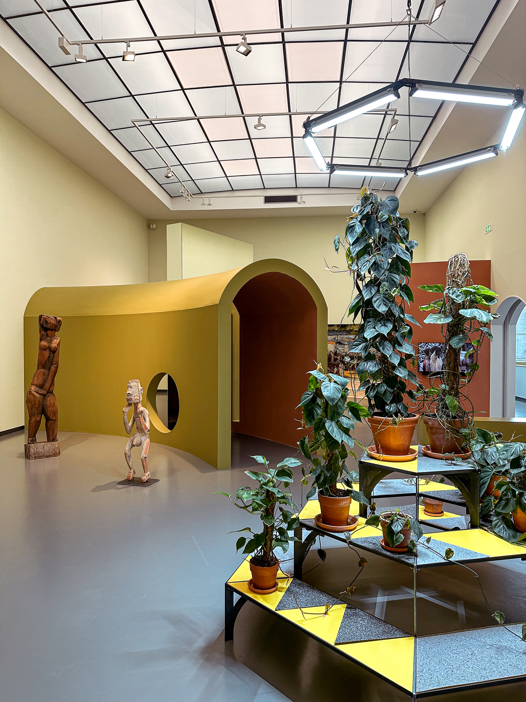
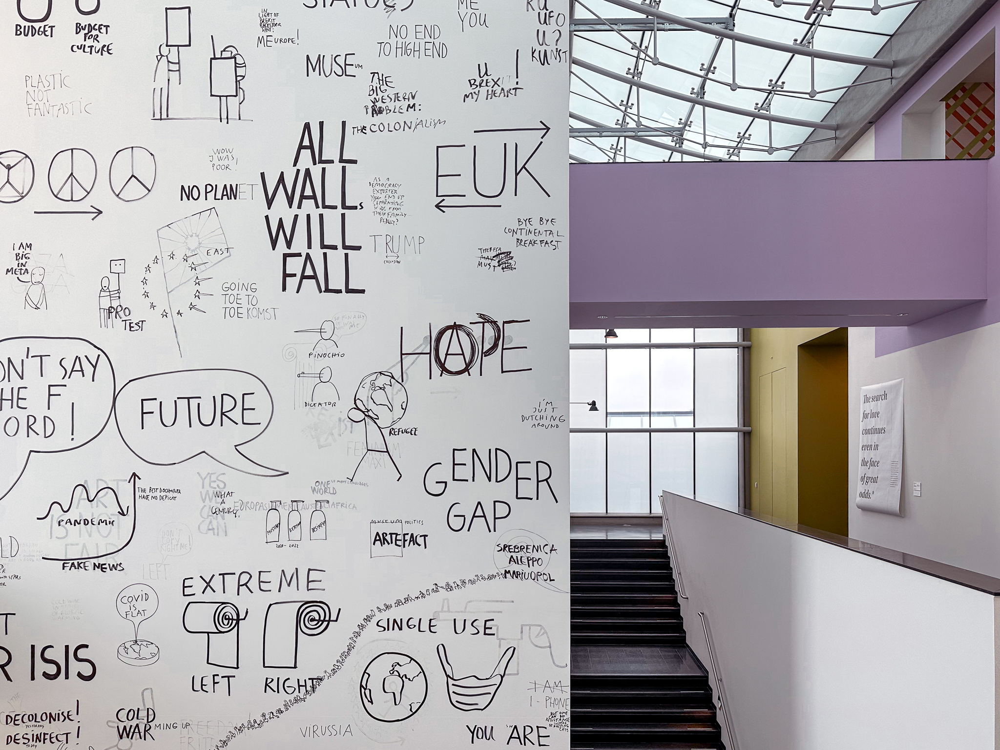
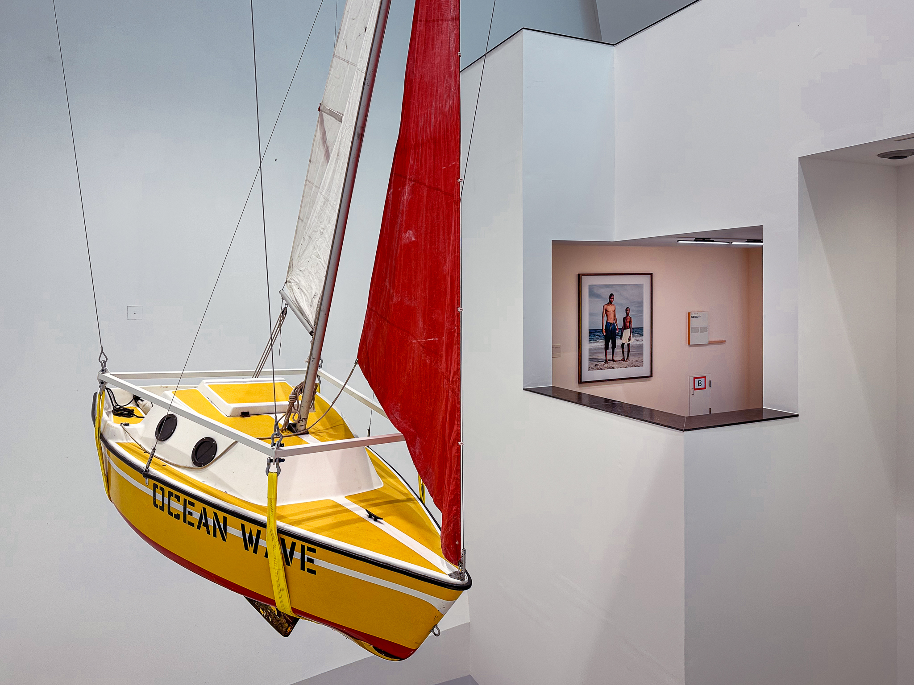

In questo periodo mi chiedo spesso da dove nasca [questo](https://www.lucamondini.it/parole/l-arte-inquieta/) [interesse](https://www.lucamondini.it/parole/per-mostre-a-milano/) mio e di Consuelo per l'arte contemporanea. La risposta, o almeno una delle risposte, l'ho trovata qualche giorno fa leggendo [Il pensiero lungo](https://martinopietropoli.substack.com/), la newsletter di Martino Pietropoli.

Nel [numero 58](https://martinopietropoli.substack.com/p/58-domande/), intitolato Domande, Martino parte dal chiedersi il motivo per cui l'essere umano si pone domande, soprattutto da bambino, e arriva a tratteggiare la differenza tra arte figurativa e contemporanea:

> Se però dovessi dire qual è la principale differenza fra arte figurativa secolare e astratta o concettuale direi che la prima fornisce risposte, la seconda pone domande. E facendolo, stimola a dare delle risposte.  
> [...]  
> Nell’arte contemporanea ci si riflette e, riconoscendoci, ci si interroga. Si inizia una conversazione con noi stessi. Si ritorna a fare domande che non si riusciva più a fare, come quelle che ci si poneva da bambini, quando Dio non esisteva e si voleva capire dove ci si trovava e cos’era questo e quello. Per capire, in fondo, chi eravamo e siamo.

Vi invito a leggerla (o ad ascoltarla) perché ne vale la pena.

Detto questo, durante il nostro recente viaggio a Eindhoven, abbiamo trascorso una mattinata intera tra le stanze del [Van Abbemuseum](https://vanabbemuseum.nl/en/), uno dei primi musei pubblici d'arte contemporanea d'Europa.

Varie cose mi hanno colpito di questo museo: l'architettura avveniristica, la qualità delle installazioni, la preparazione del personale ma, soprattutto la mostra attualmente esposta, [Delinking and Relinking](https://vanabbemuseum.nl/en/see-and-do/exhibitions-activities/delinking-and-relinking).
Si tratta della prima esposizione che abbia visitato in cui si può fruire delle opere attraverso più sensi: non solo la vista ma anche l'udito, il tatto e, in alcuni casi, l'olfatto:

> Con 120 opere d'arte che si estendono su tutti e cinque i piani dell'ala delle collezioni del museo, Delinking and Relinking invita a vivere l'arte in modo diverso. A volte in senso letterale, toccandola, annusandola o ascoltandola; altre volte in senso metaforico, dando espressione a voci diverse e meno conosciute. Per lo più stimolante e talvolta conflittuale, Delinking and Relinking attraversa più di un secolo di storia dell'arte, con Hommage à Apollinaire di Marc Chagall del 1913 come opera prima e This Means Tableau di Laure Prouvost del 2019 come opera più recente.

Un'esperienza ricca, oltre che inclusiva.

