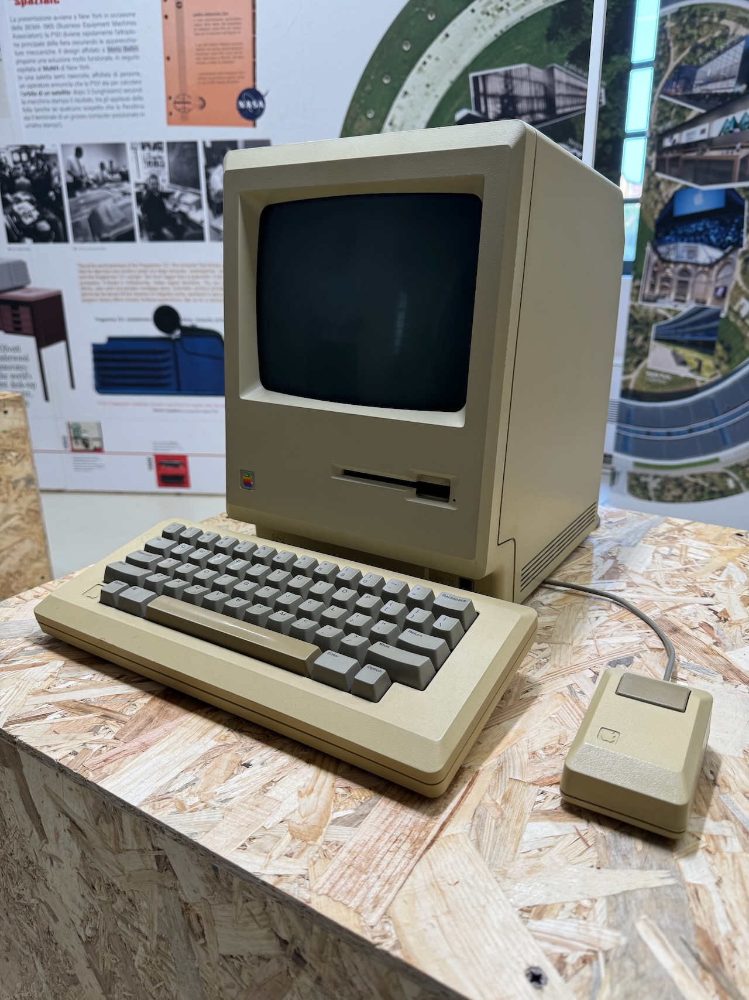


Pubblicato su [Mastodon](https://mastodon.uno/@lucamondini/111317080529025051)


Ottobre è quel mese in cui ho scritto pochissimo in questi luoghi ma ho vissuto tantissimo là fuori: ho conosciuto uno tra i più grandi collezionisti di tech vintage che mi ha guidato attraverso la storia dell’informatica; ho corso i miei primi 10 km in mezzo ad altre ventimila persone (passando il test del moribondo 😅); ho organizzato, insieme a colleghi ed amici, un evento fighissimo in azienda finendo su molti giornali.

Me felice, ecco.

